# world-state-flags
Downloads state flags from wikipedia for states/regions from all countries

## This data is NOT curated

Uses https://github.com/dr5hn/countries-states-cities-database as a dataset of Countries and States.
Then, searches for flags on wikipedia from https://en.wikipedia.org/wiki/Flags_of_country_subdivisions.

This repo will update itself once a day.

## Stats

FLAGS: 3143

Afghanistan (5/33)

BDS - Badakhshan

BDG - Badghis

BGL - Baghlan

 BAL - Balkh ✔️

 BAM - Bamyan ✔️

DAY - Daykundi

FRA - Farah

FYB - Faryab

GHA - Ghazni

GHO - Ghōr

HEL - Helmand

 HER - Herat ✔️

JOW - Jowzjan

 KAB - Kabul ✔️

 KAN - Kandahar ✔️

KAP - Kapisa

KHO - Khost

KNR - Kunar

KDZ - Kunduz Province

LAG - Laghman

LOG - Logar

NAN - Nangarhar

NIM - Nimruz

NUR - Nuristan

PIA - Paktia

PKA - Paktika

PAN - Panjshir

PAR - Parwan

SAM - Samangan

SAR - Sar-e Pol

TAK - Takhar

URU - Urozgan

ZAB - Zabul

Albania (28/47)

 01 - Berat County ✔️

 BR - Berat District ✔️

BU - Bulqizë District

 DL - Delvinë District ✔️

 DV - Devoll District ✔️

 09 - Dibër County ✔️

 DI - Dibër District ✔️

 02 - Durrës County ✔️

 DR - Durrës District ✔️

 03 - Elbasan County ✔️

 04 - Fier County ✔️

FR - Fier District

 05 - Gjirokastër County ✔️

 GJ - Gjirokastër District ✔️

GR - Gramsh District

 HA - Has District ✔️

 KA - Kavajë District ✔️

ER - Kolonjë District

 06 - Korçë County ✔️

 KO - Korçë District ✔️

 KR - Krujë District ✔️

KC - Kuçovë District

 07 - Kukës County ✔️

 KU - Kukës District ✔️

KB - Kurbin District

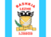 08 - Lezhë County ✔️

 LE - Lezhë District ✔️

LB - Librazhd District

 LU - Lushnjë District ✔️

MM - Malësi e Madhe District

MK - Mallakastër District

MT - Mat District

MR - Mirditë District

PQ - Peqin District

PR - Përmet District

PG - Pogradec District

PU - Pukë District

SR - Sarandë District

 10 - Shkodër County ✔️

 SH - Shkodër District ✔️

SK - Skrapar District

TE - Tepelenë District

 11 - Tirana County ✔️

 TR - Tirana District ✔️

TP - Tropojë District

 12 - Vlorë County ✔️

 VL - Vlorë District ✔️

Algeria (0/58)

01 - Adrar

44 - Aïn Defla

46 - Aïn Témouchent

16 - Algiers

23 - Annaba

05 - Batna

08 - Béchar

06 - Béjaïa

53 - Béni Abbès

07 - Biskra

09 - Blida

52 - Bordj Baji Mokhtar

34 - Bordj Bou Arréridj

10 - Bouïra

35 - Boumerdès

02 - Chlef

25 - Constantine

56 - Djanet

17 - Djelfa

32 - El Bayadh

49 - El M'ghair

50 - El Menia

39 - El Oued

36 - El Tarf

47 - Ghardaïa

24 - Guelma

33 - Illizi

58 - In Guezzam

57 - In Salah

18 - Jijel

40 - Khenchela

03 - Laghouat

28 - M'Sila

29 - Mascara

26 - Médéa

43 - Mila

27 - Mostaganem

45 - Naama

31 - Oran

30 - Ouargla

51 - Ouled Djellal

04 - Oum El Bouaghi

48 - Relizane

20 - Saïda

19 - Sétif

22 - Sidi Bel Abbès

21 - Skikda

41 - Souk Ahras

11 - Tamanghasset

12 - Tébessa

14 - Tiaret

54 - Timimoun

37 - Tindouf

42 - Tipasa

38 - Tissemsilt

15 - Tizi Ouzou

13 - Tlemcen

55 - Touggourt

Andorra ✔️ (7/7)

 07 - Andorra la Vella ✔️

 02 - Canillo ✔️

 03 - Encamp ✔️

 08 - Escaldes-Engordany ✔️

 04 - La Massana ✔️

 05 - Ordino ✔️

 06 - Sant Julià de Lòria ✔️

Angola ✔️ (17/17)

 BGO - Bengo Province ✔️

 BGU - Benguela Province ✔️

 BIE - Bié Province ✔️

 CAB - Cabinda Province ✔️

 CCU - Cuando Cubango Province ✔️

 CNO - Cuanza Norte Province ✔️

 CUS - Cuanza Sul ✔️

 CNN - Cunene Province ✔️

 HUA - Huambo Province ✔️

 HUI - Huíla Province ✔️

 LUA - Luanda Province ✔️

 LNO - Lunda Norte Province ✔️

 LSU - Lunda Sul Province ✔️

 MAL - Malanje Province ✔️

 MOX - Moxico Province ✔️

 UIG - Uíge Province ✔️

 ZAI - Zaire Province ✔️

Antigua and Barbuda (2/8)

 10 - Barbuda ✔️

 11 - Redonda ✔️

03 - Saint George Parish

04 - Saint John Parish

05 - Saint Mary Parish

06 - Saint Paul Parish

07 - Saint Peter Parish

08 - Saint Philip Parish

Argentina ✔️ (24/24)

 B - Buenos Aires ✔️

 K - Catamarca ✔️

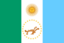 H - Chaco ✔️

 U - Chubut ✔️

 C - Ciudad Autónoma de Buenos Aires ✔️

 X - Córdoba ✔️

 W - Corrientes ✔️

 E - Entre Ríos ✔️

 P - Formosa ✔️

 Y - Jujuy ✔️

 L - La Pampa ✔️

 F - La Rioja ✔️

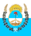 M - Mendoza ✔️

 N - Misiones ✔️

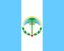 Q - Neuquén ✔️

 R - Río Negro ✔️

 A - Salta ✔️

 J - San Juan ✔️

 D - San Luis ✔️

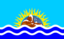 Z - Santa Cruz ✔️

 S - Santa Fe ✔️

 G - Santiago del Estero ✔️

 V - Tierra del Fuego ✔️

 T - Tucumán ✔️

Armenia ✔️ (11/11)

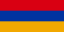 AG - Aragatsotn Region ✔️

 AR - Ararat Province ✔️

 AV - Armavir Region ✔️

 GR - Gegharkunik Province ✔️

 KT - Kotayk Region ✔️

 LO - Lori Region ✔️

 SH - Shirak Region ✔️

 SU - Syunik Province ✔️

 TV - Tavush Region ✔️

 VD - Vayots Dzor Region ✔️

 ER - Yerevan ✔️

Australia ✔️ (8/8)

 ACT - Australian Capital Territory ✔️

 NSW - New South Wales ✔️

 NT - Northern Territory ✔️

 QLD - Queensland ✔️

 SA - South Australia ✔️

 TAS - Tasmania ✔️

 VIC - Victoria ✔️

 WA - Western Australia ✔️

Austria ✔️ (9/9)

 1 - Burgenland ✔️

 2 - Carinthia ✔️

 3 - Lower Austria ✔️

 5 - Salzburg ✔️

 6 - Styria ✔️

 7 - Tyrol ✔️

 4 - Upper Austria ✔️

 9 - Vienna ✔️

 8 - Vorarlberg ✔️

Azerbaijan (1/75)

ABS - Absheron District

AGM - Agdam District

AGS - Agdash District

AGC - Aghjabadi District

AGA - Agstafa District

AGU - Agsu District

AST - Astara District

BAB - Babek District

 BA - Baku ✔️

BAL - Balakan District

BAR - Barda District

BEY - Beylagan District

BIL - Bilasuvar District

DAS - Dashkasan District

FUZ - Fizuli District

GA - Ganja

GAD - Gədəbəy

QOB - Gobustan District

GOR - Goranboy District

GOY - Goychay

GYG - Goygol District

HAC - Hajigabul District

IMI - Imishli District

ISM - Ismailli District

CAB - Jabrayil District

CAL - Jalilabad District

CUL - Julfa District

KAL - Kalbajar District

KAN - Kangarli District

XAC - Khachmaz District

XIZ - Khizi District

XCI - Khojali District

KUR - Kurdamir District

LAC - Lachin District

LAN - Lankaran

LA - Lankaran District

LER - Lerik District

XVD - Martuni

MAS - Masally District

MI - Mingachevir

NX - Nakhchivan Autonomous Republic

NEF - Neftchala District

OGU - Oghuz District

ORD - Ordubad District

QAB - Qabala District

QAX - Qakh District

QAZ - Qazakh District

QBA - Quba District

QBI - Qubadli District

QUS - Qusar District

SAT - Saatly District

SAB - Sabirabad District

SAD - Sadarak District

SAL - Salyan District

SMX - Samukh District

SBN - Shabran District

SAH - Shahbuz District

SA - Shaki

SAK - Shaki District

SMI - Shamakhi District

SKR - Shamkir District

SAR - Sharur District

SR - Shirvan

SUS - Shusha District

SIY - Siazan District

SM - Sumqayit

TAR - Tartar District

TOV - Tovuz District

UCA - Ujar District

YAR - Yardymli District

YE - Yevlakh

YEV - Yevlakh District

ZAN - Zangilan District

ZAQ - Zaqatala District

ZAR - Zardab District

Bahrain ✔️ (5/5)

 13 - Capital ✔️

 16 - Central ✔️

 15 - Muharraq ✔️

 17 - Northern ✔️

 14 - Southern ✔️

Bangladesh (0/70)

05 - Bagerhat District

33 - Bahadia

01 - Bandarban District

02 - Barguna District

06 - Barisal District

A - Barisal Division

07 - Bhola District

03 - Bogra District

04 - Brahmanbaria District

09 - Chandpur District

45 - Chapai Nawabganj District

10 - Chittagong District

B - Chittagong Division

12 - Chuadanga District

08 - Comilla District

11 - Cox's Bazar District

13 - Dhaka District

C - Dhaka Division

14 - Dinajpur District

15 - Faridpur District

16 - Feni District

19 - Gaibandha District

18 - Gazipur District

17 - Gopalganj District

20 - Habiganj District

21 - Jamalpur District

22 - Jessore District

25 - Jhalokati District

23 - Jhenaidah District

24 - Joypurhat District

29 - Khagrachari District

27 - Khulna District

D - Khulna Division

26 - Kishoreganj District

28 - Kurigram District

30 - Kushtia District

31 - Lakshmipur District

32 - Lalmonirhat District

36 - Madaripur District

39 - Meherpur District

38 - Moulvibazar District

35 - Munshiganj District

34 - Mymensingh District

H - Mymensingh Division

48 - Naogaon District

43 - Narail District

40 - Narayanganj District

44 - Natore District

41 - Netrokona District

46 - Nilphamari District

47 - Noakhali District

49 - Pabna District

52 - Panchagarh District

51 - Patuakhali District

50 - Pirojpur District

53 - Rajbari District

54 - Rajshahi District

E - Rajshahi Division

56 - Rangamati Hill District

55 - Rangpur District

F - Rangpur Division

58 - Satkhira District

62 - Shariatpur District

57 - Sherpur District

59 - Sirajganj District

61 - Sunamganj District

60 - Sylhet District

G - Sylhet Division

63 - Tangail District

64 - Thakurgaon District

Barbados (0/11)

01 - Christ Church

02 - Saint Andrew

03 - Saint George

04 - Saint James

05 - Saint John

06 - Saint Joseph

07 - Saint Lucy

08 - Saint Michael

09 - Saint Peter

10 - Saint Philip

11 - Saint Thomas

Belarus ✔️ (7/7)

 BR - Brest Region ✔️

 HO - Gomel Region ✔️

 HR - Grodno Region ✔️

 HM - Minsk ✔️

 MI - Minsk Region ✔️

 MA - Mogilev Region ✔️

 VI - Vitebsk Region ✔️

Belgium ✔️ (13/13)

 VAN - Antwerp ✔️

 BRU - Brussels-Capital Region ✔️

 VOV - East Flanders ✔️

 VLG - Flanders ✔️

 VBR - Flemish Brabant ✔️

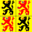 WHT - Hainaut ✔️

 WLG - Liège ✔️

 VLI - Limburg ✔️

 WLX - Luxembourg ✔️

 WNA - Namur ✔️

 WAL - Wallonia ✔️

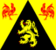 WBR - Walloon Brabant ✔️

 VWV - West Flanders ✔️

Belize (0/6)

BZ - Belize District

CY - Cayo District

CZL - Corozal District

OW - Orange Walk District

SC - Stann Creek District

TOL - Toledo District

Benin (0/12)

AL - Alibori Department

AK - Atakora Department

AQ - Atlantique Department

BO - Borgou Department

CO - Collines Department

DO - Donga Department

KO - Kouffo Department

LI - Littoral Department

MO - Mono Department

OU - Ouémé Department

PL - Plateau Department

ZO - Zou Department

Bermuda (0/9)

DEV - Devonshire

HA - Hamilton

PAG - Paget

PEM - Pembroke

SGE - Saint George's

SAN - Sandys

SMI - Smith's

SOU - Southampton

WAR - Warwick

Bhutan (0/19)

33 - Bumthang District

12 - Chukha District

22 - Dagana District

GA - Gasa District

13 - Haa District

44 - Lhuntse District

42 - Mongar District

11 - Paro District

43 - Pemagatshel District

23 - Punakha District

45 - Samdrup Jongkhar District

14 - Samtse District

31 - Sarpang District

15 - Thimphu District

41 - Trashigang District

32 - Trongsa District

21 - Tsirang District

24 - Wangdue Phodrang District

34 - Zhemgang District

Bolivia ✔️ (9/9)

 B - Beni Department ✔️

 H - Chuquisaca Department ✔️

 C - Cochabamba Department ✔️

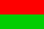 L - La Paz Department ✔️

 O - Oruro Department ✔️

 N - Pando Department ✔️

 P - Potosí Department ✔️

 S - Santa Cruz Department ✔️

 T - Tarija Department ✔️

Bonaire, Sint Eustatius and Saba (0/3)

BQ1 - Bonaire

BQ2 - Saba

BQ3 - Sint Eustatius

Bosnia and Herzegovina (12/13)

 05 - Bosnian Podrinje Canton ✔️

 BRC - Brčko District ✔️

 10 - Canton 10 ✔️

 06 - Central Bosnia Canton ✔️

BIH - Federation of Bosnia and Herzegovina

 07 - Herzegovina-Neretva Canton ✔️

 02 - Posavina Canton ✔️

 SRP - Republika Srpska ✔️

 09 - Sarajevo Canton ✔️

 03 - Tuzla Canton ✔️

 01 - Una-Sana Canton ✔️

 08 - West Herzegovina Canton ✔️

 04 - Zenica-Doboj Canton ✔️

Botswana (0/10)

CE - Central District

GH - Ghanzi District

KG - Kgalagadi District

KL - Kgatleng District

KW - Kweneng District

NG - Ngamiland

NE - North-East District

NW - North-West District

SE - South-East District

SO - Southern District

Brazil ✔️ (27/27)

 AC - Acre ✔️

 AL - Alagoas ✔️

 AP - Amapá ✔️

 AM - Amazonas ✔️

 BA - Bahia ✔️

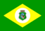 CE - Ceará ✔️

 DF - Distrito Federal ✔️

 ES - Espírito Santo ✔️

 GO - Goiás ✔️

 MA - Maranhão ✔️

 MT - Mato Grosso ✔️

 MS - Mato Grosso do Sul ✔️

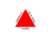 MG - Minas Gerais ✔️

 PA - Pará ✔️

 PB - Paraíba ✔️

 PR - Paraná ✔️

 PE - Pernambuco ✔️

 PI - Piauí ✔️

 RJ - Rio de Janeiro ✔️

 RN - Rio Grande do Norte ✔️

 RS - Rio Grande do Sul ✔️

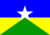 RO - Rondônia ✔️

 RR - Roraima ✔️

 SC - Santa Catarina ✔️

 SP - São Paulo ✔️

 SE - Sergipe ✔️

 TO - Tocantins ✔️

Brunei (0/4)

BE - Belait District

BM - Brunei-Muara District

TE - Temburong District

TU - Tutong District

Bulgaria ✔️ (28/28)

 01 - Blagoevgrad Province ✔️

 02 - Burgas Province ✔️

 08 - Dobrich Province ✔️

 07 - Gabrovo Province ✔️

 26 - Haskovo Province ✔️

 09 - Kardzhali Province ✔️

 10 - Kyustendil Province ✔️

 11 - Lovech Province ✔️

 12 - Montana Province ✔️

 13 - Pazardzhik Province ✔️

 14 - Pernik Province ✔️

 15 - Pleven Province ✔️

 16 - Plovdiv Province ✔️

 17 - Razgrad Province ✔️

 18 - Ruse Province ✔️

 27 - Shumen ✔️

 19 - Silistra Province ✔️

 20 - Sliven Province ✔️

 21 - Smolyan Province ✔️

 22 - Sofia City Province ✔️

 23 - Sofia Province ✔️

 24 - Stara Zagora Province ✔️

 25 - Targovishte Province ✔️

 03 - Varna Province ✔️

 04 - Veliko Tarnovo Province ✔️

 05 - Vidin Province ✔️

 06 - Vratsa Province ✔️

 28 - Yambol Province ✔️

Burkina Faso (0/57)

BAL - Balé Province

BAM - Bam Province

BAN - Banwa Province

BAZ - Bazèga Province

01 - Boucle du Mouhoun Region

BGR - Bougouriba Province

BLG - Boulgou

02 - Cascades Region

03 - Centre

04 - Centre-Est Region

05 - Centre-Nord Region

06 - Centre-Ouest Region

07 - Centre-Sud Region

COM - Comoé Province

08 - Est Region

GAN - Ganzourgou Province

GNA - Gnagna Province

GOU - Gourma Province

09 - Hauts-Bassins Region

HOU - Houet Province

IOB - Ioba Province

KAD - Kadiogo Province

KEN - Kénédougou Province

KMD - Komondjari Province

KMP - Kompienga Province

KOS - Kossi Province

KOP - Koulpélogo Province

KOT - Kouritenga Province

KOW - Kourwéogo Province

LER - Léraba Province

LOR - Loroum Province

MOU - Mouhoun

NAO - Nahouri Province

NAM - Namentenga Province

NAY - Nayala Province

10 - Nord Region, Burkina Faso

NOU - Noumbiel Province

OUB - Oubritenga Province

OUD - Oudalan Province

PAS - Passoré Province

11 - Plateau-Central Region

PON - Poni Province

12 - Sahel Region

SNG - Sanguié Province

SMT - Sanmatenga Province

SEN - Séno Province

SIS - Sissili Province

SOM - Soum Province

SOR - Sourou Province

13 - Sud-Ouest Region

TAP - Tapoa Province

TUI - Tuy Province

YAG - Yagha Province

YAT - Yatenga Province

ZIR - Ziro Province

ZON - Zondoma Province

ZOU - Zoundwéogo Province

Burundi (0/18)

BB - Bubanza Province

BM - Bujumbura Mairie Province

BL - Bujumbura Rural Province

BR - Bururi Province

CA - Cankuzo Province

CI - Cibitoke Province

GI - Gitega Province

KR - Karuzi Province

KY - Kayanza Province

KI - Kirundo Province

MA - Makamba Province

MU - Muramvya Province

MY - Muyinga Province

MW - Mwaro Province

NG - Ngozi Province

RM - Rumonge Province

RT - Rutana Province

RY - Ruyigi Province

Cambodia (0/24)

1 - Banteay Meanchey

2 - Battambang

3 - Kampong Cham

4 - Kampong Chhnang

5 - Kampong Speu

6 - Kampong Thom

7 - Kampot

8 - Kandal

23 - Kep

9 - Koh Kong

10 - Kratie

11 - Mondulkiri

22 - Oddar Meanchey

24 - Pailin

12 - Phnom Penh

13 - Preah Vihear

14 - Prey Veng

15 - Pursat

16 - Ratanakiri

17 - Siem Reap

18 - Sihanoukville

19 - Stung Treng

20 - Svay Rieng

21 - Takeo

Cameroon (0/10)

AD - Adamawa

CE - Centre

ES - East

EN - Far North

LT - Littoral

NO - North

NW - Northwest

SU - South

SW - Southwest

OU - West

Canada ✔️ (13/13)

 AB - Alberta ✔️

 BC - British Columbia ✔️

 MB - Manitoba ✔️

 NB - New Brunswick ✔️

 NL - Newfoundland and Labrador ✔️

 NT - Northwest Territories ✔️

 NS - Nova Scotia ✔️

 NU - Nunavut ✔️

 ON - Ontario ✔️

 PE - Prince Edward Island ✔️

 QC - Quebec ✔️

 SK - Saskatchewan ✔️

 YT - Yukon ✔️

Cape Verde (4/23)

 B - Barlavento Islands ✔️

BV - Boa Vista

BR - Brava

MA - Maio Municipality

 MO - Mosteiros ✔️

PA - Paul

PN - Porto Novo

PR - Praia

RB - Ribeira Brava Municipality

RG - Ribeira Grande

RS - Ribeira Grande de Santiago

SL - Sal

CA - Santa Catarina

CF - Santa Catarina do Fogo

CR - Santa Cruz

SD - São Domingos

SF - São Filipe

SO - São Lourenço dos Órgãos

 SM - São Miguel ✔️

SV - São Vicente

 S - Sotavento Islands ✔️

TA - Tarrafal

TS - Tarrafal de São Nicolau

Central African Republic (1/17)

BB - Bamingui-Bangoran Prefecture

 BGF - Bangui ✔️

BK - Basse-Kotto Prefecture

HM - Haut-Mbomou Prefecture

HK - Haute-Kotto Prefecture

KG - Kémo Prefecture

LB - Lobaye Prefecture

HS - Mambéré-Kadéï

MB - Mbomou Prefecture

KB - Nana-Grébizi Economic Prefecture

NM - Nana-Mambéré Prefecture

MP - Ombella-M'Poko Prefecture

UK - Ouaka Prefecture

AC - Ouham Prefecture

OP - Ouham-Pendé Prefecture

SE - Sangha-Mbaéré

VK - Vakaga Prefecture

Chad (0/23)

BG - Bahr el Gazel

BA - Batha

BO - Borkou

CB - Chari-Baguirmi

EE - Ennedi-Est

EO - Ennedi-Ouest

GR - Guéra

HL - Hadjer-Lamis

KA - Kanem

LC - Lac

LO - Logone Occidental

LR - Logone Oriental

MA - Mandoul

ME - Mayo-Kebbi Est

MO - Mayo-Kebbi Ouest

MC - Moyen-Chari

ND - N'Djamena

OD - Ouaddaï

SA - Salamat

SI - Sila

TA - Tandjilé

TI - Tibesti

WF - Wadi Fira

Chile ✔️ (16/16)

 AI - Aisén del General Carlos Ibañez del Campo ✔️

 AN - Antofagasta ✔️

 AP - Arica y Parinacota ✔️

 AT - Atacama ✔️

 BI - Biobío ✔️

 CO - Coquimbo ✔️

 AR - La Araucanía ✔️

 LI - Libertador General Bernardo O'Higgins ✔️

 LL - Los Lagos ✔️

 LR - Los Ríos ✔️

 MA - Magallanes y de la Antártica Chilena ✔️

 ML - Maule ✔️

 NB - Ñuble ✔️

 RM - Región Metropolitana de Santiago ✔️

 TA - Tarapacá ✔️

 VS - Valparaíso ✔️

China (31/34)

 AH - Anhui ✔️

 BJ - Beijing ✔️

 CQ - Chongqing ✔️

 FJ - Fujian ✔️

 GS - Gansu ✔️

 GD - Guangdong ✔️

GX - Guangxi Zhuang

 GZ - Guizhou ✔️

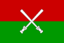 HI - Hainan ✔️

 HE - Hebei ✔️

 HL - Heilongjiang ✔️

 HA - Henan ✔️

 HK - Hong Kong SAR ✔️

 HB - Hubei ✔️

 HN - Hunan ✔️

 NM - Inner Mongolia ✔️

 JS - Jiangsu ✔️

 JX - Jiangxi ✔️

 JL - Jilin ✔️

 LN - Liaoning ✔️

 MO - Macau SAR ✔️

NX - Ningxia Huizu

 QH - Qinghai ✔️

 SN - Shaanxi ✔️

 SD - Shandong ✔️

 SH - Shanghai ✔️

 SX - Shanxi ✔️

 SC - Sichuan ✔️

 TW - Taiwan ✔️

 TJ - Tianjin ✔️

 XJ - Xinjiang ✔️

XZ - Xizang

 YN - Yunnan ✔️

 ZJ - Zhejiang ✔️

Colombia ✔️ (33/33)

 AMA - Amazonas ✔️

 ANT - Antioquia ✔️

 ARA - Arauca ✔️

 SAP - Archipiélago de San Andrés, Providencia y Santa Catalina ✔️

 ATL - Atlántico ✔️

 DC - Bogotá D.C. ✔️

 BOL - Bolívar ✔️

 BOY - Boyacá ✔️

 CAL - Caldas ✔️

 CAQ - Caquetá ✔️

 CAS - Casanare ✔️

 CAU - Cauca ✔️

 CES - Cesar ✔️

 CHO - Chocó ✔️

 COR - Córdoba ✔️

 CUN - Cundinamarca ✔️

 GUA - Guainía ✔️

 GUV - Guaviare ✔️

 HUI - Huila ✔️

 LAG - La Guajira ✔️

 MAG - Magdalena ✔️

 MET - Meta ✔️

 NAR - Nariño ✔️

 NSA - Norte de Santander ✔️

 PUT - Putumayo ✔️

 QUI - Quindío ✔️

 RIS - Risaralda ✔️

 SAN - Santander ✔️

 SUC - Sucre ✔️

 TOL - Tolima ✔️

 VAC - Valle del Cauca ✔️

 VAU - Vaupés ✔️

 VID - Vichada ✔️

Comoros ✔️ (3/3)

 A - Anjouan ✔️

 G - Grande Comore ✔️

 M - Mohéli ✔️

Congo (1/12)

11 - Bouenza Department

 BZV - Brazzaville ✔️

8 - Cuvette Department

15 - Cuvette-Ouest Department

5 - Kouilou Department

2 - Lékoumou Department

7 - Likouala Department

9 - Niari Department

14 - Plateaux Department

16 - Pointe-Noire

12 - Pool Department

13 - Sangha Department

Costa Rica ✔️ (7/7)

 A - Alajuela Province ✔️

 G - Guanacaste Province ✔️

 H - Heredia Province ✔️

 L - Limón Province ✔️

 C - Provincia de Cartago ✔️

 P - Puntarenas Province ✔️

 SJ - San José Province ✔️

Cote D'Ivoire (Ivory Coast) (0/31)

AB - Abidjan

16 - Agnéby

17 - Bafing Region

BS - Bas-Sassandra District

09 - Bas-Sassandra Region

CM - Comoé District

DN - Denguélé District

10 - Denguélé Region

06 - Dix-Huit Montagnes

18 - Fromager

GD - Gôh-Djiboua District

02 - Haut-Sassandra

LC - Lacs District

07 - Lacs Region

LG - Lagunes District

01 - Lagunes region

12 - Marahoué Region

MG - Montagnes District

19 - Moyen-Cavally

05 - Moyen-Comoé

11 - N'zi-Comoé

SM - Sassandra-Marahoué District

03 - Savanes Region

15 - Sud-Bandama

13 - Sud-Comoé

VB - Vallée du Bandama District

04 - Vallée du Bandama Region

WR - Woroba District

14 - Worodougou

YM - Yamoussoukro

ZZ - Zanzan Region

Croatia (19/21)

 07 - Bjelovar-Bilogora ✔️

 12 - Brod-Posavina ✔️

 19 - Dubrovnik-Neretva ✔️

 18 - Istria ✔️

04 - Karlovac

 06 - Koprivnica-Križevci ✔️

 02 - Krapina-Zagorje ✔️

 09 - Lika-Senj ✔️

 20 - Međimurje ✔️

 14 - Osijek-Baranja ✔️

 11 - Požega-Slavonia ✔️

 08 - Primorje-Gorski Kotar ✔️

 15 - Šibenik-Knin ✔️

 03 - Sisak-Moslavina ✔️

 17 - Split-Dalmatia ✔️

 05 - Varaždin ✔️

 10 - Virovitica-Podravina ✔️

16 - Vukovar-Syrmia

 13 - Zadar ✔️

 01 - Zagreb ✔️

 21 - Zagreb ✔️

Cuba (9/16)

15 - Artemisa Province

 09 - Camagüey Province ✔️

 08 - Ciego de Ávila Province ✔️

06 - Cienfuegos Province

 12 - Granma Province ✔️

14 - Guantánamo Province

 03 - Havana Province ✔️

 11 - Holguín Province ✔️

 99 - Isla de la Juventud ✔️

 10 - Las Tunas Province ✔️

04 - Matanzas Province

 16 - Mayabeque Province ✔️

01 - Pinar del Río Province

07 - Sancti Spíritus Province

 13 - Santiago de Cuba Province ✔️

05 - Villa Clara Province

Cyprus (1/6)

04 - Famagusta District (Mağusa)

06 - Kyrenia District (Keryneia)

03 - Larnaca District (Larnaka)

02 - Limassol District (Leymasun)

 01 - Nicosia District (Lefkoşa) ✔️

05 - Paphos District (Pafos)

Czech Republic (87/90)

 201 - Benešov ✔️

 202 - Beroun ✔️

 641 - Blansko ✔️

 644 - Břeclav ✔️

642 - Brno-město

 643 - Brno-venkov ✔️

 801 - Bruntál ✔️

 511 - Česká Lípa ✔️

 311 - České Budějovice ✔️

 312 - Český Krumlov ✔️

 411 - Cheb ✔️

 422 - Chomutov ✔️

 531 - Chrudim ✔️

 421 - Děčín ✔️

 321 - Domažlice ✔️

 802 - Frýdek-Místek ✔️

 631 - Havlíčkův Brod ✔️

 645 - Hodonín ✔️

 521 - Hradec Králové ✔️

 512 - Jablonec nad Nisou ✔️

 711 - Jeseník ✔️

 522 - Jičín ✔️

 632 - Jihlava ✔️

 31 - Jihočeský kraj ✔️

 64 - Jihomoravský kraj ✔️

 313 - Jindřichův Hradec ✔️

 41 - Karlovarský kraj ✔️

 412 - Karlovy Vary ✔️

 803 - Karviná ✔️

 203 - Kladno ✔️

 322 - Klatovy ✔️

 204 - Kolín ✔️

 63 - Kraj Vysočina ✔️

 52 - Královéhradecký kraj ✔️

 721 - Kroměříž ✔️

 205 - Kutná Hora ✔️

 513 - Liberec ✔️

 51 - Liberecký kraj ✔️

 423 - Litoměřice ✔️

 424 - Louny ✔️

 206 - Mělník ✔️

 207 - Mladá Boleslav ✔️

 80 - Moravskoslezský kraj ✔️

 425 - Most ✔️

 523 - Náchod ✔️

 804 - Nový Jičín ✔️

 208 - Nymburk ✔️

 712 - Olomouc ✔️

 71 - Olomoucký kraj ✔️

 805 - Opava ✔️

806 - Ostrava-město

 532 - Pardubice ✔️

 53 - Pardubický kraj ✔️

 633 - Pelhřimov ✔️

 314 - Písek ✔️

 324 - Plzeň-jih ✔️

323 - Plzeň-město

 325 - Plzeň-sever ✔️

 32 - Plzeňský kraj ✔️

 315 - Prachatice ✔️

 209 - Praha-východ ✔️

 20A - Praha-západ ✔️

 10 - Praha, Hlavní město ✔️

 714 - Přerov ✔️

 20B - Příbram ✔️

 713 - Prostějov ✔️

 20C - Rakovník ✔️

 326 - Rokycany ✔️

 524 - Rychnov nad Kněžnou ✔️

 514 - Semily ✔️

 413 - Sokolov ✔️

 316 - Strakonice ✔️

 20 - Středočeský kraj ✔️

 715 - Šumperk ✔️

 533 - Svitavy ✔️

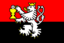 317 - Tábor ✔️

 327 - Tachov ✔️

 426 - Teplice ✔️

 634 - Třebíč ✔️

 525 - Trutnov ✔️

 722 - Uherské Hradiště ✔️

 42 - Ústecký kraj ✔️

 427 - Ústí nad Labem ✔️

 534 - Ústí nad Orlicí ✔️

 723 - Vsetín ✔️

 646 - Vyškov ✔️

 635 - Žďár nad Sázavou ✔️

 724 - Zlín ✔️

 72 - Zlínský kraj ✔️

 647 - Znojmo ✔️

Democratic Republic of the Congo (0/26)

BU - Bas-Uélé

EQ - Équateur

HK - Haut-Katanga

HL - Haut-Lomami

HU - Haut-Uélé

IT - Ituri

KS - Kasaï

KC - Kasaï Central

KE - Kasaï Oriental

KN - Kinshasa

BC - Kongo Central

KG - Kwango

KL - Kwilu

LO - Lomami

LU - Lualaba

MN - Mai-Ndombe

MA - Maniema

MO - Mongala

NK - Nord-Kivu

NU - Nord-Ubangi

SA - Sankuru

SK - Sud-Kivu

SU - Sud-Ubangi

TA - Tanganyika

TO - Tshopo

TU - Tshuapa

Denmark (4/5)

 84 - Capital Region of Denmark ✔️

 82 - Central Denmark Region ✔️

81 - North Denmark Region

 83 - Region of Southern Denmark ✔️

 85 - Region Zealand ✔️

Djibouti (0/6)

AS - Ali Sabieh Region

AR - Arta Region

DI - Dikhil Region

DJ - Djibouti

OB - Obock Region

TA - Tadjourah Region

Dominica (0/10)

02 - Saint Andrew Parish

03 - Saint David Parish

04 - Saint George Parish

05 - Saint John Parish

06 - Saint Joseph Parish

07 - Saint Luke Parish

08 - Saint Mark Parish

09 - Saint Patrick Parish

10 - Saint Paul Parish

11 - Saint Peter Parish

Dominican Republic ✔️ (31/31)

 02 - Azua Province ✔️

 03 - Baoruco Province ✔️

 04 - Barahona Province ✔️

 05 - Dajabón Province ✔️

 01 - Distrito Nacional ✔️

 06 - Duarte Province ✔️

 08 - El Seibo Province ✔️

 09 - Espaillat Province ✔️

 30 - Hato Mayor Province ✔️

 19 - Hermanas Mirabal Province ✔️

 10 - Independencia ✔️

 11 - La Altagracia Province ✔️

 12 - La Romana Province ✔️

 13 - La Vega Province ✔️

 14 - María Trinidad Sánchez Province ✔️

 28 - Monseñor Nouel Province ✔️

 15 - Monte Cristi Province ✔️

 29 - Monte Plata Province ✔️

 16 - Pedernales Province ✔️

 17 - Peravia Province ✔️

 18 - Puerto Plata Province ✔️

 20 - Samaná Province ✔️

 21 - San Cristóbal Province ✔️

 31 - San José de Ocoa Province ✔️

 22 - San Juan Province ✔️

 23 - San Pedro de Macorís ✔️

 24 - Sánchez Ramírez Province ✔️

 25 - Santiago Province ✔️

 26 - Santiago Rodríguez Province ✔️

 32 - Santo Domingo Province ✔️

 27 - Valverde Province ✔️

Ecuador ✔️ (24/24)

 A - Azuay ✔️

 B - Bolívar ✔️

 F - Cañar ✔️

 C - Carchi ✔️

 H - Chimborazo ✔️

 X - Cotopaxi ✔️

 O - El Oro ✔️

 E - Esmeraldas ✔️

 W - Galápagos ✔️

 G - Guayas ✔️

 I - Imbabura ✔️

 L - Loja ✔️

 R - Los Ríos ✔️

 M - Manabí ✔️

 S - Morona-Santiago ✔️

 N - Napo ✔️

 D - Orellana ✔️

 Y - Pastaza ✔️

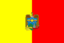 P - Pichincha ✔️

 SE - Santa Elena ✔️

 SD - Santo Domingo de los Tsáchilas ✔️

 U - Sucumbíos ✔️

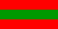 T - Tungurahua ✔️

 Z - Zamora Chinchipe ✔️

Egypt ✔️ (27/27)

 ALX - Alexandria ✔️

 ASN - Aswan ✔️

 AST - Asyut ✔️

 BH - Beheira ✔️

 BNS - Beni Suef ✔️

 C - Cairo ✔️

 DK - Dakahlia ✔️

 DT - Damietta ✔️

 FYM - Faiyum ✔️

 GH - Gharbia ✔️

 GZ - Giza ✔️

 IS - Ismailia ✔️

 KFS - Kafr el-Sheikh ✔️

 LX - Luxor ✔️

 MT - Matrouh ✔️

 MN - Minya ✔️

 MNF - Monufia ✔️

 WAD - New Valley ✔️

 SIN - North Sinai ✔️

 PTS - Port Said ✔️

 KB - Qalyubia ✔️

 KN - Qena ✔️

 BA - Red Sea ✔️

 SHR - Sharqia ✔️

 SHG - Sohag ✔️

 JS - South Sinai ✔️

 SUZ - Suez ✔️

El Salvador ✔️ (14/14)

 AH - Ahuachapán Department ✔️

 CA - Cabañas Department ✔️

 CH - Chalatenango Department ✔️

 CU - Cuscatlán Department ✔️

 LI - La Libertad Department ✔️

 PA - La Paz Department ✔️

 UN - La Unión Department ✔️

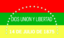 MO - Morazán Department ✔️

 SM - San Miguel Department ✔️

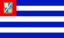 SS - San Salvador Department ✔️

 SV - San Vicente Department ✔️

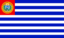 SA - Santa Ana Department ✔️

 SO - Sonsonate Department ✔️

 US - Usulután Department ✔️

Equatorial Guinea ✔️ (9/9)

 AN - Annobón Province ✔️

 BN - Bioko Norte Province ✔️

 BS - Bioko Sur Province ✔️

 CS - Centro Sur Province ✔️

 I - Insular Region ✔️

 KN - Kié-Ntem Province ✔️

 LI - Litoral Province ✔️

 C - Río Muni ✔️

 WN - Wele-Nzas Province ✔️

Eritrea (0/6)

AN - Anseba Region

DU - Debub Region

GB - Gash-Barka Region

MA - Maekel Region

SK - Northern Red Sea Region

DK - Southern Red Sea Region

Estonia ✔️ (15/15)

 37 - Harju County ✔️

 39 - Hiiu County ✔️

 44 - Ida-Viru County ✔️

 51 - Järva County ✔️

 49 - Jõgeva County ✔️

 57 - Lääne County ✔️

 59 - Lääne-Viru County ✔️

 67 - Pärnu County ✔️

 65 - Põlva County ✔️

 70 - Rapla County ✔️

 74 - Saare County ✔️

 78 - Tartu County ✔️

 82 - Valga County ✔️

 84 - Viljandi County ✔️

 86 - Võru County ✔️

Eswatini (0/4)

HH - Hhohho District

LU - Lubombo District

MA - Manzini District

SH - Shiselweni District

Ethiopia ✔️ (11/11)

 AA - Addis Ababa ✔️

 AF - Afar Region ✔️

 AM - Amhara Region ✔️

 BE - Benishangul-Gumuz Region ✔️

 DD - Dire Dawa ✔️

 GA - Gambela Region ✔️

 HA - Harari Region ✔️

 OR - Oromia Region ✔️

 SO - Somali Region ✔️

 SN - Southern Nations, Nationalities, and Peoples' Region ✔️

 TI - Tigray Region ✔️

Faroe Islands (0/6)

EY - Eysturoy

NO - Northern Isles

SA - Sandoy

ST - Streymoy

SU - Suðuroy

VA - Vágar

Fiji Islands (0/19)

01 - Ba

02 - Bua

03 - Cakaudrove

C - Central Division

E - Eastern Division

04 - Kadavu

05 - Lau

06 - Lomaiviti

07 - Macuata

08 - Nadroga-Navosa

09 - Naitasiri

10 - Namosi

N - Northern Division

11 - Ra

12 - Rewa

R - Rotuma

13 - Serua

14 - Tailevu

W - Western Division

Finland (14/19)

 01 - Åland Islands ✔️

 08 - Central Finland ✔️

 07 - Central Ostrobothnia ✔️

 19 - Finland Proper ✔️

 05 - Kainuu ✔️

09 - Kymenlaakso

 10 - Lapland ✔️

 13 - North Karelia ✔️

14 - Northern Ostrobothnia

 15 - Northern Savonia ✔️

 12 - Ostrobothnia ✔️

 16 - Päijänne Tavastia ✔️

11 - Pirkanmaa

 17 - Satakunta ✔️

02 - South Karelia

 03 - Southern Ostrobothnia ✔️

04 - Southern Savonia

 06 - Tavastia Proper ✔️

 18 - Uusimaa ✔️

France (139/123)

 01 - Ain ✔️

 02 - Aisne ✔️

 03 - Allier ✔️

 04 - Alpes-de-Haute-Provence ✔️

 06 - Alpes-Maritimes ✔️

 6AE - Alsace ✔️

 07 - Ardèche ✔️

 08 - Ardennes ✔️

 09 - Ariège ✔️

 10 - Aube ✔️

 11 - Aude ✔️

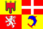 ARA - Auvergne-Rhône-Alpes ✔️

 12 - Aveyron ✔️

 67 - Bas-Rhin ✔️

 13 - Bouches-du-Rhône ✔️

 BFC - Bourgogne-Franche-Comté ✔️

 BRE - Bretagne ✔️

 14 - Calvados ✔️

 15 - Cantal ✔️

 CVL - Centre-Val de Loire ✔️

 16 - Charente ✔️

 17 - Charente-Maritime ✔️

 18 - Cher ✔️

 CP - Clipperton ✔️

 19 - Corrèze ✔️

 20R - Corse ✔️

 2A - Corse-du-Sud ✔️

 21 - Côte-d'Or ✔️

 22 - Côtes-d'Armor ✔️

 23 - Creuse ✔️

 79 - Deux-Sèvres ✔️

 24 - Dordogne ✔️

 25 - Doubs ✔️

 26 - Drôme ✔️

 91 - Essonne ✔️

 27 - Eure ✔️

 28 - Eure-et-Loir ✔️

 29 - Finistère ✔️

 973 - French Guiana ✔️

 PF - French Polynesia ✔️

 TF - French Southern and Antarctic Lands ✔️

 30 - Gard ✔️

 32 - Gers ✔️

 33 - Gironde ✔️

 GES - Grand-Est ✔️

 971 - Guadeloupe ✔️

 68 - Haut-Rhin ✔️

 2B - Haute-Corse ✔️

 31 - Haute-Garonne ✔️

 43 - Haute-Loire ✔️

 52 - Haute-Marne ✔️

 70 - Haute-Saône ✔️

 74 - Haute-Savoie ✔️

 87 - Haute-Vienne ✔️

 05 - Hautes-Alpes ✔️

 65 - Hautes-Pyrénées ✔️

 HDF - Hauts-de-France ✔️

 92 - Hauts-de-Seine ✔️

 34 - Hérault ✔️

 IDF - Île-de-France ✔️

 35 - Ille-et-Vilaine ✔️

 36 - Indre ✔️

 37 - Indre-et-Loire ✔️

 38 - Isère ✔️

 39 - Jura ✔️

 974 - La Réunion ✔️

 40 - Landes ✔️

 41 - Loir-et-Cher ✔️

 42 - Loire ✔️

 44 - Loire-Atlantique ✔️

 45 - Loiret ✔️

 46 - Lot ✔️

 47 - Lot-et-Garonne ✔️

 48 - Lozère ✔️

 49 - Maine-et-Loire ✔️

 50 - Manche ✔️

 51 - Marne ✔️

 972 - Martinique ✔️

 53 - Mayenne ✔️

 976 - Mayotte ✔️

 69M - Métropole de Lyon ✔️

 54 - Meurthe-et-Moselle ✔️

 55 - Meuse ✔️

 56 - Morbihan ✔️

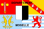 57 - Moselle ✔️

 58 - Nièvre ✔️

 59 - Nord ✔️

 NOR - Normandie ✔️

 NAQ - Nouvelle-Aquitaine ✔️

 OCC - Occitanie ✔️

 60 - Oise ✔️

 61 - Orne ✔️

 75C - Paris ✔️

 62 - Pas-de-Calais ✔️

 PDL - Pays-de-la-Loire ✔️

 PAC - Provence-Alpes-Côte-d’Azur ✔️

 63 - Puy-de-Dôme ✔️

 64 - Pyrénées-Atlantiques ✔️

 66 - Pyrénées-Orientales ✔️

 69 - Rhône ✔️

 PM - Saint Pierre and Miquelon ✔️

 BL - Saint-Barthélemy ✔️

 MF - Saint-Martin ✔️

 71 - Saône-et-Loire ✔️

 72 - Sarthe ✔️

 73 - Savoie ✔️

 77 - Seine-et-Marne ✔️

 76 - Seine-Maritime ✔️

 93 - Seine-Saint-Denis ✔️

 80 - Somme ✔️

 81 - Tarn ✔️

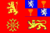 82 - Tarn-et-Garonne ✔️

 90 - Territoire de Belfort ✔️

 95 - Val-d'Oise ✔️

 94 - Val-de-Marne ✔️

 83 - Var ✔️

 84 - Vaucluse ✔️

 85 - Vendée ✔️

 86 - Vienne ✔️

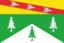 88 - Vosges ✔️

 WF - Wallis and Futuna ✔️

 89 - Yonne ✔️

 78 - Yvelines ✔️

Gabon ✔️ (9/9)

 1 - Estuaire Province ✔️

 2 - Haut-Ogooué Province ✔️

 3 - Moyen-Ogooué Province ✔️

 4 - Ngounié Province ✔️

 5 - Nyanga Province ✔️

 6 - Ogooué-Ivindo Province ✔️

 7 - Ogooué-Lolo Province ✔️

 8 - Ogooué-Maritime Province ✔️

 9 - Woleu-Ntem Province ✔️

Gambia The (0/6)

B - Banjul

M - Central River Division

L - Lower River Division

N - North Bank Division

U - Upper River Division

W - West Coast Division

Georgia (4/14)

AB - Abkhazia

 AJ - Adjara ✔️

GU - Guria

 IM - Imereti ✔️

KA - Kakheti

29 - Khelvachauri Municipality

 KK - Kvemo Kartli ✔️

MM - Mtskheta-Mtianeti

RL - Racha-Lechkhumi and Kvemo Svaneti

SZ - Samegrelo-Zemo Svaneti

SJ - Samtskhe-Javakheti

50 - Senaki Municipality

SK - Shida Kartli

 TB - Tbilisi ✔️

Germany ✔️ (16/16)

 BW - Baden-Württemberg ✔️

 BY - Bavaria ✔️

 BE - Berlin ✔️

 BB - Brandenburg ✔️

 HB - Bremen ✔️

 HH - Hamburg ✔️

 HE - Hesse ✔️

 NI - Lower Saxony ✔️

 MV - Mecklenburg-Vorpommern ✔️

 NW - North Rhine-Westphalia ✔️

 RP - Rhineland-Palatinate ✔️

 SL - Saarland ✔️

 SN - Saxony ✔️

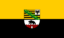 ST - Saxony-Anhalt ✔️

 SH - Schleswig-Holstein ✔️

 TH - Thuringia ✔️

Ghana (15/16)

 AF - Ahafo ✔️

 AH - Ashanti ✔️

 BO - Bono ✔️

 BE - Bono East ✔️

 CP - Central ✔️

 EP - Eastern ✔️

 AA - Greater Accra ✔️

 NE - North East ✔️

 NP - Northern ✔️

 OT - Oti ✔️

SV - Savannah

 UE - Upper East ✔️

 UW - Upper West ✔️

 TV - Volta ✔️

 WP - Western ✔️

 WN - Western North ✔️

Greece (9/38)

13 - Achaea Regional Unit

01 - Aetolia-Acarnania Regional Unit

12 - Arcadia Prefecture

11 - Argolis Regional Unit

 I - Attica Region ✔️

03 - Boeotia Regional Unit

 H - Central Greece Region ✔️

 B - Central Macedonia ✔️

94 - Chania Regional Unit

 22 - Corfu Prefecture ✔️

15 - Corinthia Regional Unit

 M - Crete Region ✔️

52 - Drama Regional Unit

A2 - East Attica Regional Unit

A - East Macedonia and Thrace

 D - Epirus Region ✔️

04 - Euboea

51 - Grevena Prefecture

53 - Imathia Regional Unit

33 - Ioannina Regional Unit

 F - Ionian Islands Region ✔️

41 - Karditsa Regional Unit

56 - Kastoria Regional Unit

23 - Kefalonia Prefecture

57 - Kilkis Regional Unit

58 - Kozani Prefecture

16 - Laconia

42 - Larissa Prefecture

24 - Lefkada Regional Unit

59 - Pella Regional Unit

 J - Peloponnese Region ✔️

06 - Phthiotis Prefecture

34 - Preveza Prefecture

62 - Serres Prefecture

 L - South Aegean ✔️

54 - Thessaloniki Regional Unit

G - West Greece Region

C - West Macedonia Region

Grenada (0/7)

10 - Carriacou and Petite Martinique

01 - Saint Andrew Parish

02 - Saint David Parish

03 - Saint George Parish

04 - Saint John Parish

05 - Saint Mark Parish

06 - Saint Patrick Parish

Guatemala ✔️ (21/21)

 AV - Alta Verapaz Department ✔️

 BV - Baja Verapaz Department ✔️

 CM - Chimaltenango Department ✔️

 CQ - Chiquimula Department ✔️

 PR - El Progreso Department ✔️

 ES - Escuintla Department ✔️

 GU - Guatemala Department ✔️

 HU - Huehuetenango Department ✔️

 IZ - Izabal Department ✔️

 JA - Jalapa Department ✔️

 JU - Jutiapa Department ✔️

 PE - Petén Department ✔️

 QZ - Quetzaltenango Department ✔️

 QC - Quiché Department ✔️

 RE - Retalhuleu Department ✔️

 SA - Sacatepéquez Department ✔️

 SM - San Marcos Department ✔️

 SR - Santa Rosa Department ✔️

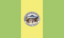 SO - Sololá Department ✔️

 SU - Suchitepéquez Department ✔️

 TO - Totonicapán Department ✔️

Guinea (0/40)

BE - Beyla Prefecture

BF - Boffa Prefecture

BK - Boké Prefecture

B - Boké Region

C - Conakry

CO - Coyah Prefecture

DB - Dabola Prefecture

DL - Dalaba Prefecture

DI - Dinguiraye Prefecture

DU - Dubréka Prefecture

FA - Faranah Prefecture

FO - Forécariah Prefecture

FR - Fria Prefecture

GA - Gaoual Prefecture

GU - Guéckédou Prefecture

KA - Kankan Prefecture

K - Kankan Region

KE - Kérouané Prefecture

KD - Kindia Prefecture

D - Kindia Region

KS - Kissidougou Prefecture

KB - Koubia Prefecture

KN - Koundara Prefecture

KO - Kouroussa Prefecture

LA - Labé Prefecture

L - Labé Region

LE - Lélouma Prefecture

LO - Lola Prefecture

MC - Macenta Prefecture

ML - Mali Prefecture

MM - Mamou Prefecture

M - Mamou Region

MD - Mandiana Prefecture

NZ - Nzérékoré Prefecture

N - Nzérékoré Region

PI - Pita Prefecture

SI - Siguiri Prefecture

TE - Télimélé Prefecture

TO - Tougué Prefecture

YO - Yomou Prefecture

Guinea-Bissau (8/11)

 BA - Bafatá ✔️

 BM - Biombo Region ✔️

 BL - Bolama Region ✔️

 CA - Cacheu Region ✔️

 GA - Gabú Region ✔️

L - Leste Province

N - Norte Province

 OI - Oio Region ✔️

 QU - Quinara Region ✔️

S - Sul Province

 TO - Tombali Region ✔️

Guyana (0/10)

BA - Barima-Waini

CU - Cuyuni-Mazaruni

DE - Demerara-Mahaica

EB - East Berbice-Corentyne

ES - Essequibo Islands-West Demerara

MA - Mahaica-Berbice

PM - Pomeroon-Supenaam

PT - Potaro-Siparuni

UD - Upper Demerara-Berbice

UT - Upper Takutu-Upper Essequibo

Haiti (0/10)

AR - Artibonite

CE - Centre

GA - Grand'Anse

NI - Nippes

ND - Nord

NE - Nord-Est

NO - Nord-Ouest

OU - Ouest

SD - Sud

SE - Sud-Est

Honduras ✔️ (18/18)

 AT - Atlántida Department ✔️

 IB - Bay Islands Department ✔️

 CH - Choluteca Department ✔️

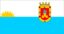 CL - Colón Department ✔️

 CM - Comayagua Department ✔️

 CP - Copán Department ✔️

 CR - Cortés Department ✔️

 EP - El Paraíso Department ✔️

 FM - Francisco Morazán Department ✔️

 GD - Gracias a Dios Department ✔️

 IN - Intibucá Department ✔️

 LP - La Paz Department ✔️

 LE - Lempira Department ✔️

 OC - Ocotepeque Department ✔️

 OL - Olancho Department ✔️

 SB - Santa Bárbara Department ✔️

 VA - Valle Department ✔️

 YO - Yoro Department ✔️

Hong Kong S.A.R. (0/18)

HCW - Central and Western

HEA - Eastern

NIS - Islands

KKC - Kowloon City

NKT - Kwai Tsing

KKT - Kwun Tong

NNO - North

NSK - Sai Kung

NST - Sha Tin

KSS - Sham Shui Po

HSO - Southern

NTP - Tai Po

NTW - Tsuen Wan

NTM - Tuen Mun

HWC - Wan Chai

KWT - Wong Tai Sin

KYT - Yau Tsim Mong

NYL - Yuen Long

Hungary ✔️ (43/43)

 BK - Bács-Kiskun ✔️

 BA - Baranya ✔️

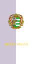 BE - Békés ✔️

 BC - Békéscsaba ✔️

 BZ - Borsod-Abaúj-Zemplén ✔️

 BU - Budapest ✔️

 CS - Csongrád County ✔️

 DE - Debrecen ✔️

 DU - Dunaújváros ✔️

 EG - Eger ✔️

 ER - Érd ✔️

 FE - Fejér County ✔️

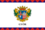 GY - Győr ✔️

 GS - Győr-Moson-Sopron County ✔️

 HB - Hajdú-Bihar County ✔️

 HE - Heves County ✔️

 HV - Hódmezővásárhely ✔️

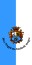 JN - Jász-Nagykun-Szolnok County ✔️

 KV - Kaposvár ✔️

 KM - Kecskemét ✔️

 KE - Komárom-Esztergom ✔️

 MI - Miskolc ✔️

 NK - Nagykanizsa ✔️

 NO - Nógrád County ✔️

 NY - Nyíregyháza ✔️

 PS - Pécs ✔️

 PE - Pest County ✔️

 ST - Salgótarján ✔️

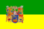 SO - Somogy County ✔️

 SN - Sopron ✔️

 SZ - Szabolcs-Szatmár-Bereg County ✔️

 SD - Szeged ✔️

 SF - Székesfehérvár ✔️

 SS - Szekszárd ✔️

 SK - Szolnok ✔️

 SH - Szombathely ✔️

 TB - Tatabánya ✔️

 TO - Tolna County ✔️

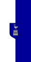 VA - Vas County ✔️

 VM - Veszprém ✔️

 VE - Veszprém County ✔️

 ZA - Zala County ✔️

 ZE - Zalaegerszeg ✔️

Iceland (0/8)

1 - Capital Region

7 - Eastern Region

6 - Northeastern Region

5 - Northwestern Region

2 - Southern Peninsula Region

8 - Southern Region

3 - Western Region

4 - Westfjords

India (37/36)

 AN - Andaman and Nicobar Islands ✔️

 AP - Andhra Pradesh ✔️

 AR - Arunachal Pradesh ✔️

 AS - Assam ✔️

 BR - Bihar ✔️

 CH - Chandigarh ✔️

 CT - Chhattisgarh ✔️

 DH - Dadra and Nagar Haveli and Daman and Diu ✔️

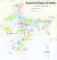 DL - Delhi ✔️

 GA - Goa ✔️

 GJ - Gujarat ✔️

 HR - Haryana ✔️

 HP - Himachal Pradesh ✔️

 JK - Jammu and Kashmir ✔️

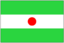 JH - Jharkhand ✔️

 KA - Karnataka ✔️

 KL - Kerala ✔️

 LA - Ladakh ✔️

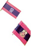 LD - Lakshadweep ✔️

 MP - Madhya Pradesh ✔️

 MH - Maharashtra ✔️

 MN - Manipur ✔️

 ML - Meghalaya ✔️

 MZ - Mizoram ✔️

 NL - Nagaland ✔️

 OR - Odisha ✔️

 PY - Puducherry ✔️

 PB - Punjab ✔️

 RJ - Rajasthan ✔️

 SK - Sikkim ✔️

 TN - Tamil Nadu ✔️

 TG - Telangana ✔️

 TR - Tripura ✔️

 UP - Uttar Pradesh ✔️

 UK - Uttarakhand ✔️

 WB - West Bengal ✔️

Indonesia ✔️ (34/34)

 AC - Aceh ✔️

 BA - Bali ✔️

 BT - Banten ✔️

 BE - Bengkulu ✔️

 YO - DI Yogyakarta ✔️

 JK - DKI Jakarta ✔️

 GO - Gorontalo ✔️

 JA - Jambi ✔️

 JB - Jawa Barat ✔️

 JT - Jawa Tengah ✔️

 JI - Jawa Timur ✔️

 KB - Kalimantan Barat ✔️

 KS - Kalimantan Selatan ✔️

 KT - Kalimantan Tengah ✔️

 KI - Kalimantan Timur ✔️

 KU - Kalimantan Utara ✔️

 BB - Kepulauan Bangka Belitung ✔️

 KR - Kepulauan Riau ✔️

 LA - Lampung ✔️

 MA - Maluku ✔️

 MU - Maluku Utara ✔️

 NB - Nusa Tenggara Barat ✔️

 NT - Nusa Tenggara Timur ✔️

 PA - Papua ✔️

 PB - Papua Barat ✔️

 RI - Riau ✔️

 SR - Sulawesi Barat ✔️

 SN - Sulawesi Selatan ✔️

 ST - Sulawesi Tengah ✔️

 SG - Sulawesi Tenggara ✔️

 SA - Sulawesi Utara ✔️

 SB - Sumatera Barat ✔️

 SS - Sumatera Selatan ✔️

 SU - Sumatera Utara ✔️

Iran (11/31)

30 - Alborz

 24 - Ardabil ✔️

 18 - Bushehr ✔️

14 - Chaharmahal and Bakhtiari

03 - East Azerbaijan

07 - Fars

 01 - Gilan ✔️

27 - Golestan

 13 - Hamadan ✔️

22 - Hormozgan

16 - Ilam

10 - Isfahan

 08 - Kerman ✔️

 05 - Kermanshah ✔️

06 - Khuzestan

17 - Kohgiluyeh and Boyer-Ahmad

12 - Kurdistan

15 - Lorestan

00 - Markazi

02 - Mazandaran

28 - North Khorasan

 26 - Qazvin ✔️

 25 - Qom ✔️

09 - Razavi Khorasan

 20 - Semnan ✔️

11 - Sistan and Baluchestan

29 - South Khorasan

 23 - Tehran ✔️

04 - West Azarbaijan

 21 - Yazd ✔️

19 - Zanjan

Iraq (9/18)

 AN - Al Anbar ✔️

MU - Al Muthanna

QA - Al-Qādisiyyah

BB - Babylon

 BG - Baghdad ✔️

 BA - Basra ✔️

DQ - Dhi Qar

 DI - Diyala ✔️

DA - Dohuk

AR - Erbil

KA - Karbala

 KI - Kirkuk ✔️

MA - Maysan

NA - Najaf

 NI - Nineveh ✔️

 SD - Saladin ✔️

 SU - Sulaymaniyah ✔️

 WA - Wasit ✔️

Ireland ✔️ (29/29)

 CW - Carlow ✔️

 CN - Cavan ✔️

 CE - Clare ✔️

 C - Connacht ✔️

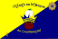 CO - Cork ✔️

 DL - Donegal ✔️

 D - Dublin ✔️

 G - Galway ✔️

 KY - Kerry ✔️

 KE - Kildare ✔️

 KK - Kilkenny ✔️

 LS - Laois ✔️

 L - Leinster ✔️

 LK - Limerick ✔️

 LD - Longford ✔️

 LH - Louth ✔️

 MO - Mayo ✔️

 MH - Meath ✔️

 MN - Monaghan ✔️

 M - Munster ✔️

 OY - Offaly ✔️

 RN - Roscommon ✔️

 SO - Sligo ✔️

 TA - Tipperary ✔️

 U - Ulster ✔️

 WD - Waterford ✔️

 WH - Westmeath ✔️

 WX - Wexford ✔️

 WW - Wicklow ✔️

Israel (3/6)

M - Central District

 HA - Haifa District ✔️

 JM - Jerusalem District ✔️

Z - Northern District

D - Southern District

 TA - Tel Aviv District ✔️

Italy (119/111)

 65 - Abruzzo ✔️

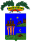 AG - Agrigento ✔️

 AL - Alessandria ✔️

 AN - Ancona ✔️

 23 - Aosta Valley ✔️

 75 - Apulia ✔️

 AP - Ascoli Piceno ✔️

 AT - Asti ✔️

 AV - Avellino ✔️

 BT - Barletta-Andria-Trani ✔️

 77 - Basilicata ✔️

 BL - Belluno ✔️

 BN - Benevento ✔️

 BG - Bergamo ✔️

 BI - Biella ✔️

 BS - Brescia ✔️

 BR - Brindisi ✔️

 78 - Calabria ✔️

 CL - Caltanissetta ✔️

 72 - Campania ✔️

 CB - Campobasso ✔️

 CE - Caserta ✔️

 CZ - Catanzaro ✔️

 CH - Chieti ✔️

 CO - Como ✔️

 CS - Cosenza ✔️

 CR - Cremona ✔️

 KR - Crotone ✔️

 CN - Cuneo ✔️

 45 - Emilia-Romagna ✔️

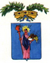 EN - Enna ✔️

FM - Fermo

 FE - Ferrara ✔️

 FG - Foggia ✔️

FC - Forlì-Cesena

36 - Friuli–Venezia Giulia

 FR - Frosinone ✔️

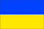 GO - Gorizia ✔️

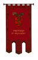 GR - Grosseto ✔️

 IM - Imperia ✔️

 IS - Isernia ✔️

 AQ - L'Aquila ✔️

 SP - La Spezia ✔️

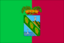 LT - Latina ✔️

 62 - Lazio ✔️

 LE - Lecce ✔️

 LC - Lecco ✔️

 42 - Liguria ✔️

 LI - Livorno ✔️

 LO - Lodi ✔️

 25 - Lombardy ✔️

 LU - Lucca ✔️

 MC - Macerata ✔️

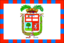 MN - Mantua ✔️

 57 - Marche ✔️

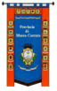 MS - Massa and Carrara ✔️

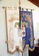 MT - Matera ✔️

VS - Medio Campidano

 MO - Modena ✔️

 67 - Molise ✔️

 MB - Monza and Brianza ✔️

 NO - Novara ✔️

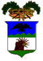 NU - Nuoro ✔️

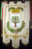 OR - Oristano ✔️

 PD - Padua ✔️

 PA - Palermo ✔️

 PR - Parma ✔️

 PV - Pavia ✔️

PG - Perugia

PU - Pesaro and Urbino

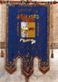 PE - Pescara ✔️

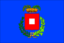 PC - Piacenza ✔️

 21 - Piedmont ✔️

 PI - Pisa ✔️

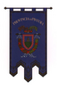 PT - Pistoia ✔️

 PN - Pordenone ✔️

 PZ - Potenza ✔️

 PO - Prato ✔️

 RG - Ragusa ✔️

 RA - Ravenna ✔️

 RE - Reggio Emilia ✔️

 RI - Rieti ✔️

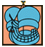 RN - Rimini ✔️

 RO - Rovigo ✔️

 SA - Salerno ✔️

 88 - Sardinia ✔️

 SS - Sassari ✔️

 SV - Savona ✔️

 82 - Sicily ✔️

 SI - Siena ✔️

 SR - Siracusa ✔️

 SO - Sondrio ✔️

SU - South Sardinia

 TA - Taranto ✔️

 TE - Teramo ✔️

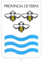 TR - Terni ✔️

 TP - Trapani ✔️

 32 - Trentino-South Tyrol ✔️

 TV - Treviso ✔️

 TS - Trieste ✔️

 52 - Tuscany ✔️

 UD - Udine ✔️

 55 - Umbria ✔️

 VA - Varese ✔️

 34 - Veneto ✔️

 VB - Verbano-Cusio-Ossola ✔️

 VC - Vercelli ✔️

 VR - Verona ✔️

 VV - Vibo Valentia ✔️

 VI - Vicenza ✔️

 VT - Viterbo ✔️

Jamaica (0/14)

13 - Clarendon Parish

09 - Hanover Parish

01 - Kingston Parish

12 - Manchester Parish

04 - Portland Parish

02 - Saint Andrew

06 - Saint Ann Parish

14 - Saint Catherine Parish

11 - Saint Elizabeth Parish

08 - Saint James Parish

05 - Saint Mary Parish

03 - Saint Thomas Parish

07 - Trelawny Parish

10 - Westmoreland Parish

Japan ✔️ (47/47)

 23 - Aichi Prefecture ✔️

 05 - Akita Prefecture ✔️

 02 - Aomori Prefecture ✔️

 12 - Chiba Prefecture ✔️

 38 - Ehime Prefecture ✔️

 18 - Fukui Prefecture ✔️

 40 - Fukuoka Prefecture ✔️

 07 - Fukushima Prefecture ✔️

 21 - Gifu Prefecture ✔️

 10 - Gunma Prefecture ✔️

 34 - Hiroshima Prefecture ✔️

 01 - Hokkaidō Prefecture ✔️

 28 - Hyōgo Prefecture ✔️

 08 - Ibaraki Prefecture ✔️

 17 - Ishikawa Prefecture ✔️

 03 - Iwate Prefecture ✔️

 37 - Kagawa Prefecture ✔️

 46 - Kagoshima Prefecture ✔️

 14 - Kanagawa Prefecture ✔️

 39 - Kōchi Prefecture ✔️

 43 - Kumamoto Prefecture ✔️

 26 - Kyōto Prefecture ✔️

 24 - Mie Prefecture ✔️

 04 - Miyagi Prefecture ✔️

 45 - Miyazaki Prefecture ✔️

 20 - Nagano Prefecture ✔️

 42 - Nagasaki Prefecture ✔️

 29 - Nara Prefecture ✔️

 15 - Niigata Prefecture ✔️

 44 - Ōita Prefecture ✔️

 33 - Okayama Prefecture ✔️

 47 - Okinawa Prefecture ✔️

 27 - Ōsaka Prefecture ✔️

 41 - Saga Prefecture ✔️

 11 - Saitama Prefecture ✔️

 25 - Shiga Prefecture ✔️

 32 - Shimane Prefecture ✔️

 22 - Shizuoka Prefecture ✔️

 09 - Tochigi Prefecture ✔️

 36 - Tokushima Prefecture ✔️

 13 - Tokyo ✔️

 31 - Tottori Prefecture ✔️

 16 - Toyama Prefecture ✔️

 30 - Wakayama Prefecture ✔️

 06 - Yamagata Prefecture ✔️

 35 - Yamaguchi Prefecture ✔️

 19 - Yamanashi Prefecture ✔️

Jordan (2/12)

AJ - Ajloun

 AM - Amman ✔️

AQ - Aqaba

BA - Balqa

 IR - Irbid ✔️

JA - Jerash

KA - Karak

MN - Ma'an

MD - Madaba

MA - Mafraq

AT - Tafilah

AZ - Zarqa

Kazakhstan (9/17)

AKM - Akmola Region

 AKT - Aktobe Region ✔️

 ALA - Almaty ✔️

 ALM - Almaty Region ✔️

 ATY - Atyrau Region ✔️

 BAY - Baikonur ✔️

VOS - East Kazakhstan Region

ZHA - Jambyl Region

 KAR - Karaganda Region ✔️

 KUS - Kostanay Region ✔️

KZY - Kyzylorda Region

MAN - Mangystau Region

SEV - North Kazakhstan Region

 AST - Nur-Sultan ✔️

 PAV - Pavlodar Region ✔️

YUZ - Turkestan Region

ZAP - West Kazakhstan Province

Kenya (45/47)

 01 - Baringo ✔️

 02 - Bomet ✔️

 03 - Bungoma ✔️

 04 - Busia ✔️

 05 - Elgeyo-Marakwet ✔️

 06 - Embu ✔️

 07 - Garissa ✔️

 08 - Homa Bay ✔️

 09 - Isiolo ✔️

 10 - Kajiado ✔️

 11 - Kakamega ✔️

 12 - Kericho ✔️

 13 - Kiambu ✔️

 14 - Kilifi ✔️

 15 - Kirinyaga ✔️

 16 - Kisii ✔️

 17 - Kisumu ✔️

 18 - Kitui ✔️

 19 - Kwale ✔️

 20 - Laikipia ✔️

 21 - Lamu ✔️

 22 - Machakos ✔️

 23 - Makueni ✔️

 24 - Mandera ✔️

 25 - Marsabit ✔️

 26 - Meru ✔️

 27 - Migori ✔️

 28 - Mombasa ✔️

 29 - Murang'a ✔️

 30 - Nairobi City ✔️

 31 - Nakuru ✔️

 32 - Nandi ✔️

 33 - Narok ✔️

 34 - Nyamira ✔️

 35 - Nyandarua ✔️

 36 - Nyeri ✔️

 37 - Samburu ✔️

 38 - Siaya ✔️

 39 - Taita–Taveta ✔️

 40 - Tana River ✔️

41 - Tharaka-Nithi

42 - Trans Nzoia

 43 - Turkana ✔️

 44 - Uasin Gishu ✔️

 45 - Vihiga ✔️

 46 - Wajir ✔️

 47 - West Pokot ✔️

Kiribati (0/3)

G - Gilbert Islands

L - Line Islands

P - Phoenix Islands

Kosovo (3/7)

XDG - Đakovica District (Gjakove)

 XGJ - Gjilan District ✔️

XKM - Kosovska Mitrovica District

XPE - Peć District

 XPI - Pristina (Priştine) ✔️

 XPR - Prizren District ✔️

XUF - Uroševac District (Ferizaj)

Kuwait (0/6)

AH - Al Ahmadi

FA - Al Farwaniyah

JA - Al Jahra

KU - Capital

HA - Hawalli

MU - Mubarak Al-Kabeer

Kyrgyzstan ✔️ (9/9)

 B - Batken Region ✔️

 GB - Bishkek ✔️

 C - Chuy Region ✔️

 Y - Issyk-Kul Region ✔️

 J - Jalal-Abad Region ✔️

 N - Naryn Region ✔️

 GO - Osh ✔️

 O - Osh Region ✔️

 T - Talas Region ✔️

Laos (0/19)

AT - Attapeu Province

BK - Bokeo Province

BL - Bolikhamsai Province

CH - Champasak Province

HO - Houaphanh Province

KH - Khammouane Province

LM - Luang Namtha Province

LP - Luang Prabang Province

OU - Oudomxay Province

PH - Phongsaly Province

XA - Sainyabuli Province

SL - Salavan Province

SV - Savannakhet Province

XE - Sekong Province

VT - Vientiane Prefecture

VI - Vientiane Province

XN - Xaisomboun

XS - Xaisomboun Province

XI - Xiangkhouang Province

Latvia (63/118)

001 - Aglona Municipality

 002 - Aizkraukle Municipality ✔️

 003 - Aizpute Municipality ✔️

004 - Aknīste Municipality

005 - Aloja Municipality

006 - Alsunga Municipality

 007 - Alūksne Municipality ✔️

008 - Amata Municipality

009 - Ape Municipality

010 - Auce Municipality

012 - Babīte Municipality

013 - Baldone Municipality

014 - Baltinava Municipality

 015 - Balvi Municipality ✔️

 016 - Bauska Municipality ✔️

017 - Beverīna Municipality

 018 - Brocēni Municipality ✔️

 019 - Burtnieki Municipality ✔️

020 - Carnikava Municipality

 022 - Cēsis Municipality ✔️

021 - Cesvaine Municipality

023 - Cibla Municipality

024 - Dagda Municipality

 DGV - Daugavpils ✔️

 025 - Daugavpils Municipality ✔️

 026 - Dobele Municipality ✔️

027 - Dundaga Municipality

028 - Durbe Municipality

029 - Engure Municipality

030 - Ērgļi Municipality

 031 - Garkalne Municipality ✔️

032 - Grobiņa Municipality

 033 - Gulbene Municipality ✔️

034 - Iecava Municipality

 035 - Ikšķile Municipality ✔️

036 - Ilūkste Municipality

037 - Inčukalns Municipality

038 - Jaunjelgava Municipality

 039 - Jaunpiebalga Municipality ✔️

040 - Jaunpils Municipality

 JKB - Jēkabpils ✔️

 042 - Jēkabpils Municipality ✔️

 JEL - Jelgava ✔️

 041 - Jelgava Municipality ✔️

 JUR - Jūrmala ✔️

043 - Kandava Municipality

044 - Kārsava Municipality

 051 - Ķegums Municipality ✔️

 052 - Ķekava Municipality ✔️

 045 - Kocēni Municipality ✔️

046 - Koknese Municipality

 047 - Krāslava Municipality ✔️

048 - Krimulda Municipality

 049 - Krustpils Municipality ✔️

 050 - Kuldīga Municipality ✔️

 053 - Lielvārde Municipality ✔️

 LPX - Liepāja ✔️

055 - Līgatne Municipality

 054 - Limbaži Municipality ✔️

 056 - Līvāni Municipality ✔️

057 - Lubāna Municipality

 058 - Ludza Municipality ✔️

 059 - Madona Municipality ✔️

061 - Mālpils Municipality

 062 - Mārupe Municipality ✔️

060 - Mazsalaca Municipality

063 - Mērsrags Municipality

064 - Naukšēni Municipality

065 - Nereta Municipality

 066 - Nīca Municipality ✔️

 067 - Ogre Municipality ✔️

 068 - Olaine Municipality ✔️

069 - Ozolnieki Municipality

 070 - Pārgauja Municipality ✔️

 071 - Pāvilosta Municipality ✔️

072 - Pļaviņas Municipality

 073 - Preiļi Municipality ✔️

 074 - Priekule Municipality ✔️

075 - Priekuļi Municipality

076 - Rauna Municipality

 REZ - Rēzekne ✔️

 077 - Rēzekne Municipality ✔️

078 - Riebiņi Municipality

 RIX - Riga ✔️

 079 - Roja Municipality ✔️

 080 - Ropaži Municipality ✔️

081 - Rucava Municipality

082 - Rugāji Municipality

084 - Rūjiena Municipality

 083 - Rundāle Municipality ✔️

 085 - Sala Municipality ✔️

 086 - Salacgrīva Municipality ✔️

 087 - Salaspils Municipality ✔️

 088 - Saldus Municipality ✔️

 089 - Saulkrasti Municipality ✔️

090 - Sēja Municipality

 091 - Sigulda Municipality ✔️

092 - Skrīveri Municipality

 093 - Skrunda Municipality ✔️

 094 - Smiltene Municipality ✔️

095 - Stopiņi Municipality

096 - Strenči Municipality

 097 - Talsi Municipality ✔️

 098 - Tērvete Municipality ✔️

 099 - Tukums Municipality ✔️

100 - Vaiņode Municipality

 101 - Valka Municipality ✔️

 VMR - Valmiera ✔️

 102 - Varakļāni Municipality ✔️

103 - Vārkava Municipality

104 - Vecpiebalga Municipality

105 - Vecumnieki Municipality

 VEN - Ventspils ✔️

 106 - Ventspils Municipality ✔️

107 - Viesīte Municipality

 108 - Viļaka Municipality ✔️

109 - Viļāni Municipality

110 - Zilupe Municipality

Lebanon (0/8)

AK - Akkar

BH - Baalbek-Hermel

BA - Beirut

BI - Beqaa

JL - Mount Lebanon

NA - Nabatieh

AS - North

JA - South

Lesotho (0/10)

D - Berea District

B - Butha-Buthe District

C - Leribe District

E - Mafeteng District

A - Maseru District

F - Mohale's Hoek District

J - Mokhotlong District

H - Qacha's Nek District

G - Quthing District

K - Thaba-Tseka District

Liberia ✔️ (15/15)

 BM - Bomi County ✔️

 BG - Bong County ✔️

 GP - Gbarpolu County ✔️

 GB - Grand Bassa County ✔️

 CM - Grand Cape Mount County ✔️

 GG - Grand Gedeh County ✔️

 GK - Grand Kru County ✔️

 LO - Lofa County ✔️

 MG - Margibi County ✔️

 MY - Maryland County ✔️

 MO - Montserrado County ✔️

 NI - Nimba ✔️

 RI - River Cess County ✔️

 RG - River Gee County ✔️

 SI - Sinoe County ✔️

Libya (0/21)

WA - Al Wahat District

BA - Benghazi

DR - Derna District

GT - Ghat District

JA - Jabal al Akhdar

JG - Jabal al Gharbi District

JI - Jafara

JU - Jufra

KF - Kufra District

MJ - Marj District

MI - Misrata District

MB - Murqub

MQ - Murzuq District

NL - Nalut District

NQ - Nuqat al Khams

SB - Sabha District

SR - Sirte District

TB - Tripoli District

WD - Wadi al Hayaa District

WS - Wadi al Shatii District

ZA - Zawiya District

Liechtenstein ✔️ (11/11)

 01 - Balzers ✔️

 02 - Eschen ✔️

 03 - Gamprin ✔️

 04 - Mauren ✔️

 05 - Planken ✔️

 06 - Ruggell ✔️

 07 - Schaan ✔️

 08 - Schellenberg ✔️

 09 - Triesen ✔️

 10 - Triesenberg ✔️

 11 - Vaduz ✔️

Lithuania (10/69)

01 - Akmenė District Municipality

02 - Alytus City Municipality

 AL - Alytus County ✔️

03 - Alytus District Municipality

05 - Birštonas Municipality

06 - Biržai District Municipality

07 - Druskininkai municipality

08 - Elektrėnai municipality

09 - Ignalina District Municipality

10 - Jonava District Municipality

11 - Joniškis District Municipality

12 - Jurbarkas District Municipality

13 - Kaišiadorys District Municipality

14 - Kalvarija municipality

15 - Kaunas City Municipality

 KU - Kaunas County ✔️

16 - Kaunas District Municipality

17 - Kazlų Rūda municipality

18 - Kėdainiai District Municipality

19 - Kelmė District Municipality

20 - Klaipeda City Municipality

 KL - Klaipėda County ✔️

21 - Klaipėda District Municipality

22 - Kretinga District Municipality

23 - Kupiškis District Municipality

24 - Lazdijai District Municipality

 MR - Marijampolė County ✔️

25 - Marijampolė Municipality

26 - Mažeikiai District Municipality

27 - Molėtai District Municipality

28 - Neringa Municipality

29 - Pagėgiai municipality

30 - Pakruojis District Municipality

31 - Palanga City Municipality

32 - Panevėžys City Municipality

 PN - Panevėžys County ✔️

33 - Panevėžys District Municipality

34 - Pasvalys District Municipality

35 - Plungė District Municipality

36 - Prienai District Municipality

37 - Radviliškis District Municipality

38 - Raseiniai District Municipality

39 - Rietavas municipality

40 - Rokiškis District Municipality

41 - Šakiai District Municipality

42 - Šalčininkai District Municipality

43 - Šiauliai City Municipality

 SA - Šiauliai County ✔️

44 - Šiauliai District Municipality

45 - Šilalė District Municipality

46 - Šilutė District Municipality

47 - Širvintos District Municipality

48 - Skuodas District Municipality

49 - Švenčionys District Municipality

 TA - Tauragė County ✔️

50 - Tauragė District Municipality

 TE - Telšiai County ✔️

51 - Telšiai District Municipality

52 - Trakai District Municipality

53 - Ukmergė District Municipality

 UT - Utena County ✔️

54 - Utena District Municipality

55 - Varėna District Municipality

56 - Vilkaviškis District Municipality

57 - Vilnius City Municipality

 VL - Vilnius County ✔️

58 - Vilnius District Municipality

59 - Visaginas Municipality

60 - Zarasai District Municipality

Luxembourg (3/15)

CA - Canton of Capellen

CL - Canton of Clervaux

DI - Canton of Diekirch

EC - Canton of Echternach

ES - Canton of Esch-sur-Alzette

GR - Canton of Grevenmacher

 LU - Canton of Luxembourg ✔️

ME - Canton of Mersch

RD - Canton of Redange

RM - Canton of Remich

VD - Canton of Vianden

 WI - Canton of Wiltz ✔️

D - Diekirch District

G - Grevenmacher District

 L - Luxembourg District ✔️

Madagascar (0/6)

T - Antananarivo Province

D - Antsiranana Province

F - Fianarantsoa Province

M - Mahajanga Province

A - Toamasina Province

U - Toliara Province

Malawi (0/30)

BA - Balaka District

BL - Blantyre District

C - Central Region

CK - Chikwawa District

CR - Chiradzulu District

CT - Chitipa district

DE - Dedza District

DO - Dowa District

KR - Karonga District

KS - Kasungu District

LK - Likoma District

LI - Lilongwe District

MH - Machinga District

MG - Mangochi District

MC - Mchinji District

MU - Mulanje District

MW - Mwanza District

MZ - Mzimba District

NB - Nkhata Bay District

NK - Nkhotakota District

N - Northern Region

NS - Nsanje District

NU - Ntcheu District

NI - Ntchisi District

PH - Phalombe District

RU - Rumphi District

SA - Salima District

S - Southern Region

TH - Thyolo District

ZO - Zomba District

Malaysia ✔️ (16/16)

 01 - Johor ✔️

 02 - Kedah ✔️

 03 - Kelantan ✔️

 14 - Kuala Lumpur ✔️

 15 - Labuan ✔️

 04 - Malacca ✔️

 05 - Negeri Sembilan ✔️

 06 - Pahang ✔️

 07 - Penang ✔️

 08 - Perak ✔️

 09 - Perlis ✔️

 16 - Putrajaya ✔️

 12 - Sabah ✔️

 13 - Sarawak ✔️

 10 - Selangor ✔️

 11 - Terengganu ✔️

Maldives (0/26)

01 - Addu Atoll

02 - Alif Alif Atoll

00 - Alif Dhaal Atoll

CE - Central Province

17 - Dhaalu Atoll

14 - Faafu Atoll

27 - Gaafu Alif Atoll

28 - Gaafu Dhaalu Atoll

29 - Gnaviyani Atoll

07 - Haa Alif Atoll

23 - Haa Dhaalu Atoll

26 - Kaafu Atoll

05 - Laamu Atoll

03 - Lhaviyani Atoll

MLE - Malé

12 - Meemu Atoll

25 - Noonu Atoll

NC - North Central Province

NO - North Province

13 - Raa Atoll

24 - Shaviyani Atoll

SC - South Central Province

SU - South Province

08 - Thaa Atoll

US - Upper South Province

04 - Vaavu Atoll

Mali (0/11)

BKO - Bamako

7 - Gao Region

1 - Kayes Region

8 - Kidal Region

2 - Koulikoro Region

9 - Ménaka Region

5 - Mopti Region

4 - Ségou Region

3 - Sikasso Region

10 - Taoudénit Region

6 - Tombouctou Region

Malta ✔️ (67/67)

 01 - Attard ✔️

 02 - Balzan ✔️

 03 - Birgu ✔️

 04 - Birkirkara ✔️

 05 - Birżebbuġa ✔️

 06 - Cospicua ✔️

 07 - Dingli ✔️

 08 - Fgura ✔️

 09 - Floriana ✔️

 10 - Fontana ✔️

 13 - Għajnsielem ✔️

 14 - Għarb ✔️

 15 - Għargħur ✔️

 16 - Għasri ✔️

 17 - Għaxaq ✔️

 11 - Gudja ✔️

 12 - Gżira ✔️

 18 - Ħamrun ✔️

 19 - Iklin ✔️

 21 - Kalkara ✔️

 22 - Kerċem ✔️

 23 - Kirkop ✔️

 24 - Lija ✔️

 25 - Luqa ✔️

 26 - Marsa ✔️

 27 - Marsaskala ✔️

 28 - Marsaxlokk ✔️

 29 - Mdina ✔️

 30 - Mellieħa ✔️

 31 - Mġarr ✔️

 32 - Mosta ✔️

 33 - Mqabba ✔️

 34 - Msida ✔️

 35 - Mtarfa ✔️

 36 - Munxar ✔️

 37 - Nadur ✔️

 38 - Naxxar ✔️

 39 - Paola ✔️

 40 - Pembroke ✔️

 41 - Pietà ✔️

 42 - Qala ✔️

 43 - Qormi ✔️

 44 - Qrendi ✔️

 46 - Rabat ✔️

 49 - San Ġwann ✔️

 50 - San Lawrenz ✔️

 52 - Sannat ✔️

 53 - Santa Luċija ✔️

 54 - Santa Venera ✔️

 20 - Senglea ✔️

 55 - Siġġiewi ✔️

 56 - Sliema ✔️

 48 - St. Julian's ✔️

 51 - St. Paul's Bay ✔️

 57 - Swieqi ✔️

 58 - Ta' Xbiex ✔️

 59 - Tarxien ✔️

 60 - Valletta ✔️

 45 - Victoria ✔️

 61 - Xagħra ✔️

 62 - Xewkija ✔️

 63 - Xgħajra ✔️

 64 - Żabbar ✔️

 65 - Żebbuġ Gozo ✔️

 66 - Żebbuġ Malta ✔️

 67 - Żejtun ✔️

 68 - Żurrieq ✔️

Marshall Islands ✔️ (2/2)

 L - Ralik Chain ✔️

 T - Ratak Chain ✔️

Mauritania (0/15)

07 - Adrar

03 - Assaba

05 - Brakna

08 - Dakhlet Nouadhibou

04 - Gorgol

10 - Guidimaka

01 - Hodh Ech Chargui

02 - Hodh El Gharbi

12 - Inchiri

14 - Nouakchott-Nord

13 - Nouakchott-Ouest

15 - Nouakchott-Sud

09 - Tagant

11 - Tiris Zemmour

06 - Trarza

Mauritius (4/12)

AG - Agalega Islands

BL - Black River

FL - Flacq

GP - Grand Port

MO - Moka

PA - Pamplemousses

PW - Plaines Wilhems

 PL - Port Louis ✔️

RR - Rivière du Rempart

 RO - Rodrigues Island ✔️

CC - Saint Brandon Islands

SA - Savanne

Mexico ✔️ (32/32)

 AGU - Aguascalientes ✔️

 BCN - Baja California ✔️

 BCS - Baja California Sur ✔️

 CAM - Campeche ✔️

 CHP - Chiapas ✔️

 CHH - Chihuahua ✔️

 CMX - Ciudad de México ✔️

 COA - Coahuila de Zaragoza ✔️

 COL - Colima ✔️

 DUR - Durango ✔️

 MEX - Estado de México ✔️

 GUA - Guanajuato ✔️

 GRO - Guerrero ✔️

 HID - Hidalgo ✔️

 JAL - Jalisco ✔️

 MIC - Michoacán de Ocampo ✔️

 MOR - Morelos ✔️

 NAY - Nayarit ✔️

 NLE - Nuevo León ✔️

 OAX - Oaxaca ✔️

 PUE - Puebla ✔️

 QUE - Querétaro ✔️

 ROO - Quintana Roo ✔️

 SLP - San Luis Potosí ✔️

 SIN - Sinaloa ✔️

 SON - Sonora ✔️

 TAB - Tabasco ✔️

 TAM - Tamaulipas ✔️

 TLA - Tlaxcala ✔️

 VER - Veracruz de Ignacio de la Llave ✔️

 YUC - Yucatán ✔️

 ZAC - Zacatecas ✔️

Micronesia ✔️ (4/4)

 TRK - Chuuk State ✔️

 KSA - Kosrae State ✔️

 PNI - Pohnpei State ✔️

 YAP - Yap State ✔️

Moldova (35/36)

 AN - Anenii Noi District ✔️

 BA - Bălți Municipality ✔️

 BS - Basarabeasca District ✔️

 BD - Bender Municipality ✔️

 BR - Briceni District ✔️

 CA - Cahul District ✔️

 CL - Călărași District ✔️

 CT - Cantemir District ✔️

 CS - Căușeni District ✔️

 CU - Chișinău Municipality ✔️

 CM - Cimișlia District ✔️

 CR - Criuleni District ✔️

 DO - Dondușeni District ✔️

 DR - Drochia District ✔️

 DU - Dubăsari District ✔️

 ED - Edineț District ✔️

 FA - Fălești District ✔️

 FL - Florești District ✔️

 GA - Gagauzia ✔️

 GL - Glodeni District ✔️

 HI - Hîncești District ✔️

 IA - Ialoveni District ✔️

 NI - Nisporeni District ✔️

 OC - Ocnița District ✔️

 OR - Orhei District ✔️

 RE - Rezina District ✔️

 RI - Rîșcani District ✔️

 SI - Sîngerei District ✔️

 SD - Șoldănești District ✔️

 SO - Soroca District ✔️

 SV - Ștefan Vodă District ✔️

 ST - Strășeni District ✔️

 TA - Taraclia District ✔️

 TE - Telenești District ✔️

SN - Transnistria autonomous territorial unit

 UN - Ungheni District ✔️

Monaco (0/3)

CL - La Colle

CO - La Condamine

MG - Moneghetti

Mongolia ✔️ (21/21)

 073 - Arkhangai Province ✔️

 071 - Bayan-Ölgii Province ✔️

 069 - Bayankhongor Province ✔️

 067 - Bulgan Province ✔️

 037 - Darkhan-Uul Province ✔️

 061 - Dornod Province ✔️

 063 - Dornogovi Province ✔️

 059 - Dundgovi Province ✔️

 065 - Govi-Altai Province ✔️

 064 - Govisümber Province ✔️

 039 - Khentii Province ✔️

 043 - Khovd Province ✔️

 041 - Khövsgöl Province ✔️

 053 - Ömnögovi Province ✔️

 035 - Orkhon Province ✔️

 055 - Övörkhangai Province ✔️

 049 - Selenge Province ✔️

 051 - Sükhbaatar Province ✔️

 047 - Töv Province ✔️

 046 - Uvs Province ✔️

 057 - Zavkhan Province ✔️

Montenegro ✔️ (22/22)

 01 - Andrijevica Municipality ✔️

 02 - Bar Municipality ✔️

 03 - Berane Municipality ✔️

 04 - Bijelo Polje Municipality ✔️

 05 - Budva Municipality ✔️

 07 - Danilovgrad Municipality ✔️

 22 - Gusinje Municipality ✔️

 09 - Kolašin Municipality ✔️

 10 - Kotor Municipality ✔️

 11 - Mojkovac Municipality ✔️

 12 - Nikšić Municipality ✔️

 06 - Old Royal Capital Cetinje ✔️

 23 - Petnjica Municipality ✔️

 13 - Plav Municipality ✔️

 14 - Pljevlja Municipality ✔️

 15 - Plužine Municipality ✔️

 16 - Podgorica Municipality ✔️

 17 - Rožaje Municipality ✔️

 18 - Šavnik Municipality ✔️

 19 - Tivat Municipality ✔️

 20 - Ulcinj Municipality ✔️

 21 - Žabljak Municipality ✔️

Morocco (39/87)

 AGD - Agadir-Ida-Ou-Tanane ✔️

HAO - Al Haouz

 HOC - Al Hoceïma ✔️

AOU - Aousserd (EH)

ASZ - Assa-Zag (EH-partial)

 AZI - Azilal ✔️

 BEM - Béni Mellal ✔️

05 - Béni Mellal-Khénifra

 BES - Benslimane ✔️

BER - Berkane

BRR - Berrechid

 BOD - Boujdour (EH) ✔️

BOM - Boulemane

 CAS - Casablanca ✔️

06 - Casablanca-Settat

 CHE - Chefchaouen ✔️

CHI - Chichaoua

CHT - Chtouka-Ait Baha

12 - Dakhla-Oued Ed-Dahab (EH)

08 - Drâa-Tafilalet

DRI - Driouch

HAJ - El Hajeb

 JDI - El Jadida ✔️

 KES - El Kelâa des Sraghna ✔️

 ERR - Errachidia ✔️

ESM - Es-Semara (EH-partial)

 ESI - Essaouira ✔️

FAH - Fahs-Anjra

 FES - Fès ✔️

03 - Fès-Meknès

 FIG - Figuig ✔️

FQH - Fquih Ben Salah

 GUE - Guelmim ✔️

10 - Guelmim-Oued Noun (EH-partial)

GUF - Guercif

 IFR - Ifrane ✔️

INE - Inezgane-Ait Melloul

JRA - Jerada

 KEN - Kénitra ✔️

 KHE - Khémisset ✔️

 KHN - Khénifra ✔️

 KHO - Khouribga ✔️

02 - L'Oriental

 LAA - Laâyoune (EH) ✔️

11 - Laâyoune-Sakia El Hamra (EH-partial)

 LAR - Larache ✔️

MDF - M’diq-Fnideq

 MAR - Marrakech ✔️

07 - Marrakesh-Safi

MED - Médiouna

 MEK - Meknès ✔️

MID - Midelt

MOH - Mohammadia

MOU - Moulay Yacoub

 NAD - Nador ✔️

NOU - Nouaceur

 OUA - Ouarzazate ✔️

OUD - Oued Ed-Dahab (EH)

OUZ - Ouezzane

 OUJ - Oujda-Angad ✔️

RAB - Rabat

04 - Rabat-Salé-Kénitra

REH - Rehamna

 SAF - Safi ✔️

SAL - Salé

SEF - Sefrou

 SET - Settat ✔️

 SIB - Sidi Bennour ✔️

SIF - Sidi Ifni

 SIK - Sidi Kacem ✔️

SIL - Sidi Slimane

SKH - Skhirate-Témara

09 - Souss-Massa

 TNT - Tan-Tan (EH-partial) ✔️

 TNG - Tanger-Assilah ✔️

01 - Tanger-Tétouan-Al Hoceïma

 TAO - Taounate ✔️

TAI - Taourirt

TAF - Tarfaya (EH-partial)

 TAR - Taroudannt ✔️

 TAT - Tata ✔️

 TAZ - Taza ✔️

 TET - Tétouan ✔️

TIN - Tinghir

 TIZ - Tiznit ✔️

YUS - Youssoufia

ZAG - Zagora

Mozambique ✔️ (11/11)

 P - Cabo Delgado Province ✔️

 G - Gaza Province ✔️

 I - Inhambane Province ✔️

 B - Manica Province ✔️

 MPM - Maputo ✔️

 L - Maputo Province ✔️

 N - Nampula Province ✔️

 A - Niassa Province ✔️

 S - Sofala Province ✔️

 T - Tete Province ✔️

 Q - Zambezia Province ✔️

Myanmar ✔️ (15/15)

 07 - Ayeyarwady Region ✔️

 02 - Bago ✔️

 14 - Chin State ✔️

 11 - Kachin State ✔️

 12 - Kayah State ✔️

 13 - Kayin State ✔️

 03 - Magway Region ✔️

 04 - Mandalay Region ✔️

 15 - Mon State ✔️

 18 - Naypyidaw Union Territory ✔️

 16 - Rakhine State ✔️

 01 - Sagaing Region ✔️

 17 - Shan State ✔️

 05 - Tanintharyi Region ✔️

 06 - Yangon Region ✔️

Namibia (1/14)

ER - Erongo Region

HA - Hardap Region

KA - Karas Region

KE - Kavango East Region

KW - Kavango West Region

KH - Khomas Region

 KU - Kunene Region ✔️

OW - Ohangwena Region

OH - Omaheke Region

OS - Omusati Region

ON - Oshana Region

OT - Oshikoto Region

OD - Otjozondjupa Region

CA - Zambezi Region

Nauru (0/14)

01 - Aiwo District

02 - Anabar District

03 - Anetan District

04 - Anibare District

05 - Baiti District

06 - Boe District

07 - Buada District

08 - Denigomodu District

09 - Ewa District

10 - Ijuw District

11 - Meneng District

12 - Nibok District

13 - Uaboe District

14 - Yaren District

Nepal (0/19)

BA - Bagmati Zone

BH - Bheri Zone

1 - Central Region

DH - Dhaulagiri Zone

4 - Eastern Development Region

5 - Far-Western Development Region

GA - Gandaki Zone

JA - Janakpur Zone

KA - Karnali Zone

KO - Kosi Zone

LU - Lumbini Zone

MA - Mahakali Zone

ME - Mechi Zone

2 - Mid-Western Region

NA - Narayani Zone

RA - Rapti Zone

SA - Sagarmatha Zone

SE - Seti Zone

3 - Western Region

Netherlands ✔️ (15/15)

 BQ1 - Bonaire ✔️

 DR - Drenthe ✔️

 FL - Flevoland ✔️

 FR - Friesland ✔️

 GE - Gelderland ✔️

 GR - Groningen ✔️

 LI - Limburg ✔️

 NB - North Brabant ✔️

 NH - North Holland ✔️

 OV - Overijssel ✔️

 BQ2 - Saba ✔️

 BQ3 - Sint Eustatius ✔️

 ZH - South Holland ✔️

 UT - Utrecht ✔️

 ZE - Zeeland ✔️

New Caledonia (0/3)

03 - Loyalty Islands Province

02 - North Province

01 - South Province

New Zealand (14/17)

 AUK - Auckland Region ✔️

 BOP - Bay of Plenty Region ✔️

 CAN - Canterbury Region ✔️

 CIT - Chatham Islands ✔️

GIS - Gisborne District

HKB - Hawke's Bay Region

 MWT - Manawatu-Wanganui Region ✔️

MBH - Marlborough Region

 NSN - Nelson Region ✔️

 NTL - Northland Region ✔️

 OTA - Otago Region ✔️

 STL - Southland Region ✔️

 TKI - Taranaki Region ✔️

 TAS - Tasman District ✔️

 WKO - Waikato Region ✔️

 WGN - Wellington Region ✔️

 WTC - West Coast Region ✔️

Nicaragua ✔️ (17/17)

 BO - Boaco ✔️

 CA - Carazo ✔️

 CI - Chinandega ✔️

 CO - Chontales ✔️

 ES - Estelí ✔️

 GR - Granada ✔️

 JI - Jinotega ✔️

 LE - León ✔️

 MD - Madriz ✔️

 MN - Managua ✔️

 MS - Masaya ✔️

 MT - Matagalpa ✔️

 AN - North Caribbean Coast ✔️

 NS - Nueva Segovia ✔️

 SJ - Río San Juan ✔️

 RI - Rivas ✔️

 AS - South Caribbean Coast ✔️

Niger (0/7)

1 - Agadez Region

2 - Diffa Region

3 - Dosso Region

4 - Maradi Region

5 - Tahoua Region

6 - Tillabéri Region

7 - Zinder Region

Nigeria ✔️ (37/37)

 AB - Abia ✔️

 FC - Abuja Federal Capital Territory ✔️

 AD - Adamawa ✔️

 AK - Akwa Ibom ✔️

 AN - Anambra ✔️

 BA - Bauchi ✔️

 BY - Bayelsa ✔️

 BE - Benue ✔️

 BO - Borno ✔️

 CR - Cross River ✔️

 DE - Delta ✔️

 EB - Ebonyi ✔️

 ED - Edo ✔️

 EK - Ekiti ✔️

 EN - Enugu ✔️

 GO - Gombe ✔️

 IM - Imo ✔️

 JI - Jigawa ✔️

 KD - Kaduna ✔️

 KN - Kano ✔️

 KT - Katsina ✔️

 KE - Kebbi ✔️

 KO - Kogi ✔️

 KW - Kwara ✔️

 LA - Lagos ✔️

 NA - Nasarawa ✔️

 NI - Niger ✔️

 OG - Ogun ✔️

 ON - Ondo ✔️

 OS - Osun ✔️

 OY - Oyo ✔️

 PL - Plateau ✔️

 RI - Rivers ✔️

 SO - Sokoto ✔️

 TA - Taraba ✔️

 YO - Yobe ✔️

 ZA - Zamfara ✔️

North Korea ✔️ (11/11)

 04 - Chagang Province ✔️

 07 - Kangwon Province ✔️

 09 - North Hamgyong Province ✔️

 06 - North Hwanghae Province ✔️

 03 - North Pyongan Province ✔️

 01 - Pyongyang ✔️

 13 - Rason ✔️

 10 - Ryanggang Province ✔️

 08 - South Hamgyong Province ✔️

 05 - South Hwanghae Province ✔️

 02 - South Pyongan Province ✔️

North Macedonia (73/84)

 01 - Aerodrom Municipality ✔️

 02 - Aračinovo Municipality ✔️

 03 - Berovo Municipality ✔️

 04 - Bitola Municipality ✔️

 05 - Bogdanci Municipality ✔️

 06 - Bogovinje Municipality ✔️

 07 - Bosilovo Municipality ✔️

 08 - Brvenica Municipality ✔️

 09 - Butel Municipality ✔️

 79 - Čair Municipality ✔️

 80 - Čaška Municipality ✔️

77 - Centar Municipality

 78 - Centar Župa Municipality ✔️

 81 - Češinovo-Obleševo Municipality ✔️

 82 - Čučer-Sandevo Municipality ✔️

 22 - Debarca Municipality ✔️

 23 - Delčevo Municipality ✔️

 25 - Demir Hisar Municipality ✔️

 24 - Demir Kapija Municipality ✔️

 26 - Dojran Municipality ✔️

 27 - Dolneni Municipality ✔️

28 - Drugovo Municipality

 17 - Gazi Baba Municipality ✔️

 18 - Gevgelija Municipality ✔️

 29 - Gjorče Petrov Municipality ✔️

 19 - Gostivar Municipality ✔️

20 - Gradsko Municipality

85 - Greater Skopje

 34 - Ilinden Municipality ✔️

 35 - Jegunovce Municipality ✔️

 37 - Karbinci ✔️

 38 - Karpoš Municipality ✔️

 36 - Kavadarci Municipality ✔️

40 - Kičevo Municipality

 39 - Kisela Voda Municipality ✔️

 42 - Kočani Municipality ✔️

 41 - Konče Municipality ✔️

 43 - Kratovo Municipality ✔️

 44 - Kriva Palanka Municipality ✔️

 45 - Krivogaštani Municipality ✔️

 46 - Kruševo Municipality ✔️

 47 - Kumanovo Municipality ✔️

 48 - Lipkovo Municipality ✔️

 49 - Lozovo Municipality ✔️

 51 - Makedonska Kamenica Municipality ✔️

 52 - Makedonski Brod Municipality ✔️

 50 - Mavrovo and Rostuša Municipality ✔️

 53 - Mogila Municipality ✔️

 54 - Negotino Municipality ✔️

 55 - Novaci Municipality ✔️

 56 - Novo Selo Municipality ✔️

58 - Ohrid Municipality

57 - Oslomej Municipality

 60 - Pehčevo Municipality ✔️

 59 - Petrovec Municipality ✔️

 61 - Plasnica Municipality ✔️

 62 - Prilep Municipality ✔️

63 - Probištip Municipality

 64 - Radoviš Municipality ✔️

 65 - Rankovce Municipality ✔️

 66 - Resen Municipality ✔️

 67 - Rosoman Municipality ✔️

68 - Saraj Municipality

 70 - Sopište Municipality ✔️

 71 - Staro Nagoričane Municipality ✔️

 83 - Štip Municipality ✔️

 72 - Struga Municipality ✔️

 73 - Strumica Municipality ✔️

 74 - Studeničani Municipality ✔️

 84 - Šuto Orizari Municipality ✔️

 69 - Sveti Nikole Municipality ✔️

 75 - Tearce Municipality ✔️

 76 - Tetovo Municipality ✔️

 10 - Valandovo Municipality ✔️

 11 - Vasilevo Municipality ✔️

 13 - Veles Municipality ✔️

 12 - Vevčani Municipality ✔️

 14 - Vinica Municipality ✔️

15 - Vraneštica Municipality

 16 - Vrapčište Municipality ✔️

31 - Zajas Municipality

 32 - Zelenikovo Municipality ✔️

 30 - Želino Municipality ✔️

 33 - Zrnovci Municipality ✔️

Norway (21/13)

 42 - Agder ✔️

34 - Innlandet

22 - Jan Mayen

 15 - Møre og Romsdal ✔️

 18 - Nordland ✔️

 03 - Oslo ✔️

 11 - Rogaland ✔️

21 - Svalbard

54 - Troms og Finnmark

 50 - Trøndelag ✔️

 38 - Vestfold og Telemark ✔️

46 - Vestland

30 - Viken

Oman (0/13)

DA - Ad Dakhiliyah

ZA - Ad Dhahirah

BS - Al Batinah North

BA - Al Batinah Region

BJ - Al Batinah South

BU - Al Buraimi

WU - Al Wusta

SS - Ash Sharqiyah North

SH - Ash Sharqiyah Region

SJ - Ash Sharqiyah South

ZU - Dhofar

MU - Musandam

MA - Muscat

Pakistan ✔️ (8/8)

 JK - Azad Kashmir ✔️

 BA - Balochistan ✔️

 TA - Federally Administered Tribal Areas ✔️

 GB - Gilgit-Baltistan ✔️

 IS - Islamabad Capital Territory ✔️

 KP - Khyber Pakhtunkhwa ✔️

 PB - Punjab ✔️

 SD - Sindh ✔️

Palau ✔️ (16/16)

 002 - Aimeliik ✔️

 004 - Airai ✔️

 010 - Angaur ✔️

 050 - Hatohobei ✔️

 100 - Kayangel ✔️

 150 - Koror ✔️

 212 - Melekeok ✔️

 214 - Ngaraard ✔️

 218 - Ngarchelong ✔️

 222 - Ngardmau ✔️

 224 - Ngatpang ✔️

 226 - Ngchesar ✔️

 227 - Ngeremlengui ✔️

 228 - Ngiwal ✔️

 350 - Peleliu ✔️

 370 - Sonsorol ✔️

Palestinian Territory Occupied (1/16)

BTH - Bethlehem

DEB - Deir El Balah

 GZA - Gaza ✔️

HBN - Hebron

JEN - Jenin

JRH - Jericho and Al Aghwar

JEM - Jerusalem

KYS - Khan Yunis

NBS - Nablus

NGZ - North Gaza

QQA - Qalqilya

RFH - Rafah

RBH - Ramallah

SLT - Salfit

TBS - Tubas

TKM - Tulkarm

Panama (11/13)

 1 - Bocas del Toro Province ✔️

 4 - Chiriquí Province ✔️

 2 - Coclé Province ✔️

 3 - Colón Province ✔️

 5 - Darién Province ✔️

EM - Emberá-Wounaan Comarca

 KY - Guna Yala ✔️

 6 - Herrera Province ✔️

 7 - Los Santos Province ✔️

NB - Ngöbe-Buglé Comarca

 10 - Panamá Oeste Province ✔️

 8 - Panamá Province ✔️

 9 - Veraguas Province ✔️

Papua New Guinea (21/22)

 NSB - Bougainville ✔️

 CPM - Central Province ✔️

 CPK - Chimbu Province ✔️

 EBR - East New Britain ✔️

ESW - East Sepik

 EHG - Eastern Highlands Province ✔️

 EPW - Enga Province ✔️

 GPK - Gulf ✔️

 HLA - Hela ✔️

 JWK - Jiwaka Province ✔️

 MPM - Madang Province ✔️

 MRL - Manus Province ✔️

 MBA - Milne Bay Province ✔️

 MPL - Morobe Province ✔️

 NIK - New Ireland Province ✔️

 NPP - Oro Province ✔️

 NCD - Port Moresby ✔️

 SAN - Sandaun Province ✔️

 SHM - Southern Highlands Province ✔️

 WBK - West New Britain Province ✔️

 WHM - Western Highlands Province ✔️

 WPD - Western Province ✔️

Paraguay ✔️ (18/18)

 16 - Alto Paraguay Department ✔️

 10 - Alto Paraná Department ✔️

 13 - Amambay Department ✔️

 ASU - Asuncion ✔️

 19 - Boquerón Department ✔️

 5 - Caaguazú ✔️

 6 - Caazapá ✔️

 14 - Canindeyú ✔️

 11 - Central Department ✔️

 1 - Concepción Department ✔️

 3 - Cordillera Department ✔️

 4 - Guairá Department ✔️

 7 - Itapúa ✔️

 8 - Misiones Department ✔️

 12 - Ñeembucú Department ✔️

 9 - Paraguarí Department ✔️

 15 - Presidente Hayes Department ✔️

 2 - San Pedro Department ✔️

Peru ✔️ (25/25)

 AMA - Amazonas ✔️

 ANC - Áncash ✔️

 APU - Apurímac ✔️

 ARE - Arequipa ✔️

 AYA - Ayacucho ✔️

 CAJ - Cajamarca ✔️

 CAL - Callao ✔️

 CUS - Cusco ✔️

 HUV - Huancavelica ✔️

 HUC - Huanuco ✔️

 ICA - Ica ✔️

 JUN - Junín ✔️

 LAL - La Libertad ✔️

 LAM - Lambayeque ✔️

 LIM - Lima ✔️

 LOR - Loreto ✔️

 MDD - Madre de Dios ✔️

 MOQ - Moquegua ✔️

 PAS - Pasco ✔️

 PIU - Piura ✔️

 PUN - Puno ✔️

 SAM - San Martín ✔️

 TAC - Tacna ✔️

 TUM - Tumbes ✔️

 UCA - Ucayali ✔️

Philippines (94/98)

 ABR - Abra ✔️

 AGN - Agusan del Norte ✔️

 AGS - Agusan del Sur ✔️

 AKL - Aklan ✔️

 ALB - Albay ✔️

 ANT - Antique ✔️

 APA - Apayao ✔️

 AUR - Aurora ✔️

14 - Autonomous Region in Muslim Mindanao

 BAS - Basilan ✔️

 BAN - Bataan ✔️

 BTN - Batanes ✔️

 BTG - Batangas ✔️

 BEN - Benguet ✔️

 05 - Bicol ✔️

 BIL - Biliran ✔️

 BOH - Bohol ✔️

 BUK - Bukidnon ✔️

 BUL - Bulacan ✔️

 CAG - Cagayan ✔️

 02 - Cagayan Valley ✔️

 40 - Calabarzon ✔️

 CAN - Camarines Norte ✔️

 CAS - Camarines Sur ✔️

 CAM - Camiguin ✔️

 CAP - Capiz ✔️

 13 - Caraga ✔️

 CAT - Catanduanes ✔️

 CAV - Cavite ✔️

 CEB - Cebu ✔️

 03 - Central Luzon ✔️

 07 - Central Visayas ✔️

COM - Compostela Valley

15 - Cordillera Administrative

 NCO - Cotabato ✔️

 11 - Davao ✔️

 DAV - Davao del Norte ✔️

 DAS - Davao del Sur ✔️

 DVO - Davao Occidental ✔️

 DAO - Davao Oriental ✔️

 DIN - Dinagat Islands ✔️

 EAS - Eastern Samar ✔️

 08 - Eastern Visayas ✔️

 GUI - Guimaras ✔️

 IFU - Ifugao ✔️

 01 - Ilocos ✔️

 ILN - Ilocos Norte ✔️

 ILS - Ilocos Sur ✔️

 ILI - Iloilo ✔️

 ISA - Isabela ✔️

 KAL - Kalinga ✔️

 LUN - La Union ✔️

 LAG - Laguna ✔️

 LAN - Lanao del Norte ✔️

 LAS - Lanao del Sur ✔️

 LEY - Leyte ✔️

 MAG - Maguindanao ✔️

 MAD - Marinduque ✔️

 MAS - Masbate ✔️

 NCR - Metro Manila ✔️

 41 - Mimaropa ✔️

 MSC - Misamis Occidental ✔️

 MSR - Misamis Oriental ✔️

 MOU - Mountain Province ✔️

 NEC - Negros Occidental ✔️

 NER - Negros Oriental ✔️

 10 - Northern Mindanao ✔️

 NSA - Northern Samar ✔️

 NUE - Nueva Ecija ✔️

 NUV - Nueva Vizcaya ✔️

 MDC - Occidental Mindoro ✔️

 MDR - Oriental Mindoro ✔️

 PLW - Palawan ✔️

 PAM - Pampanga ✔️

 PAN - Pangasinan ✔️

 QUE - Quezon ✔️

 QUI - Quirino ✔️

 RIZ - Rizal ✔️

 ROM - Romblon ✔️

 SAR - Sarangani ✔️

 SIG - Siquijor ✔️

 12 - Soccsksargen ✔️

 SOR - Sorsogon ✔️

 SCO - South Cotabato ✔️

 SLE - Southern Leyte ✔️

 SUK - Sultan Kudarat ✔️

 SLU - Sulu ✔️

 SUN - Surigao del Norte ✔️

 SUR - Surigao del Sur ✔️

 TAR - Tarlac ✔️

 TAW - Tawi-Tawi ✔️

WSA - Western Samar

 06 - Western Visayas ✔️

 ZMB - Zambales ✔️

 ZAN - Zamboanga del Norte ✔️

 ZAS - Zamboanga del Sur ✔️

 09 - Zamboanga Peninsula ✔️

 ZSI - Zamboanga Sibugay ✔️

Poland ✔️ (16/16)

30 - Greater Poland

26 - Holy Cross

04 - Kuyavia-Pomerania

12 - Lesser Poland

02 - Lower Silesia

06 - Lublin

08 - Lubusz

10 - Łódź

14 - Mazovia

20 - Podlaskie

22 - Pomerania

24 - Silesia

18 - Subcarpathia

16 - Upper Silesia

28 - Warmia-Masuria

32 - West Pomerania

Portugal ✔️ (20/20)

 20 - Açores ✔️

 01 - Aveiro ✔️

 02 - Beja ✔️

 03 - Braga ✔️

 04 - Bragança ✔️

 05 - Castelo Branco ✔️

 06 - Coimbra ✔️

 07 - Évora ✔️

 08 - Faro ✔️

 09 - Guarda ✔️

 10 - Leiria ✔️

 11 - Lisbon ✔️

 30 - Madeira ✔️

 12 - Portalegre ✔️

 13 - Porto ✔️

 14 - Santarém ✔️

 15 - Setúbal ✔️

 16 - Viana do Castelo ✔️

 17 - Vila Real ✔️

 18 - Viseu ✔️

Puerto Rico ✔️ (88/88)

 001 - Adjuntas ✔️

 003 - Aguada ✔️

 005 - Aguadilla ✔️

 007 - Aguas Buenas ✔️

 009 - Aibonito ✔️

 011 - Añasco ✔️

 013 - Arecibo ✔️

 AR - Arecibo ✔️

 015 - Arroyo ✔️

 017 - Barceloneta ✔️

 019 - Barranquitas ✔️

 BY - Bayamon ✔️

 021 - Bayamón ✔️

 023 - Cabo Rojo ✔️

 CG - Caguas ✔️

 025 - Caguas ✔️

 027 - Camuy ✔️

 029 - Canóvanas ✔️

 CL - Carolina ✔️

 031 - Carolina ✔️

 033 - Cataño ✔️

 035 - Cayey ✔️

 037 - Ceiba ✔️

 039 - Ciales ✔️

 041 - Cidra ✔️

 043 - Coamo ✔️

 045 - Comerío ✔️

 047 - Corozal ✔️

 049 - Culebra ✔️

 051 - Dorado ✔️

 053 - Fajardo ✔️

 054 - Florida ✔️

 055 - Guánica ✔️

 057 - Guayama ✔️

 059 - Guayanilla ✔️

 GN - Guaynabo ✔️

 061 - Guaynabo ✔️

 063 - Gurabo ✔️

 065 - Hatillo ✔️

 067 - Hormigueros ✔️

 069 - Humacao ✔️

 071 - Isabela ✔️

 073 - Jayuya ✔️

 075 - Juana Díaz ✔️

 077 - Juncos ✔️

 079 - Lajas ✔️

 081 - Lares ✔️

 083 - Las Marías ✔️

 085 - Las Piedras ✔️

 087 - Loíza ✔️

 089 - Luquillo ✔️

 091 - Manatí ✔️

 093 - Maricao ✔️

 095 - Maunabo ✔️

 MG - Mayagüez ✔️

 097 - Mayagüez ✔️

 099 - Moca ✔️

 101 - Morovis ✔️

 103 - Naguabo ✔️

 105 - Naranjito ✔️

 107 - Orocovis ✔️

 109 - Patillas ✔️

 111 - Peñuelas ✔️

 PO - Ponce ✔️

 113 - Ponce ✔️

 115 - Quebradillas ✔️

 117 - Rincón ✔️

 119 - Río Grande ✔️

 121 - Sabana Grande ✔️

 123 - Salinas ✔️

 125 - San Germán ✔️

 127 - San Juan ✔️

 SJ - San Juan ✔️

 129 - San Lorenzo ✔️

 131 - San Sebastián ✔️

 133 - Santa Isabel ✔️

 135 - Toa Alta ✔️

 TB - Toa Baja ✔️

 137 - Toa Baja ✔️

 TA - Trujillo Alto ✔️

 139 - Trujillo Alto ✔️

 141 - Utuado ✔️

 143 - Vega Alta ✔️

 145 - Vega Baja ✔️

 147 - Vieques ✔️

 149 - Villalba ✔️

 151 - Yabucoa ✔️

 153 - Yauco ✔️

Qatar (0/8)

ZA - Al Daayen

KH - Al Khor

RA - Al Rayyan Municipality

WA - Al Wakrah

SH - Al-Shahaniya

DA - Doha

MS - Madinat ash Shamal

US - Umm Salal Municipality

Romania (18/42)

 AB - Alba ✔️

 AR - Arad County ✔️

 AG - Arges ✔️

BC - Bacău County

 BH - Bihor County ✔️

BN - Bistrița-Năsăud County

BT - Botoșani County

 BR - Braila ✔️

BV - Brașov County

 B - Bucharest ✔️

BZ - Buzău County

 CL - Călărași County ✔️

 CS - Caraș-Severin County ✔️

 CJ - Cluj County ✔️

CT - Constanța County

 CV - Covasna County ✔️

DB - Dâmbovița County

 DJ - Dolj County ✔️

 GL - Galați County ✔️

 GR - Giurgiu County ✔️

GJ - Gorj County

 HR - Harghita County ✔️

HD - Hunedoara County

 IL - Ialomița County ✔️

IS - Iași County

IF - Ilfov County

 MM - Maramureș County ✔️

MH - Mehedinți County

 MS - Mureș County ✔️

NT - Neamț County

OT - Olt County

PH - Prahova County

SJ - Sălaj County

 SM - Satu Mare County ✔️

SB - Sibiu County

SV - Suceava County

TR - Teleorman County

TM - Timiș County

TL - Tulcea County

VL - Vâlcea County

VS - Vaslui County

VN - Vrancea County

Russia (72/83)

 ALT - Altai Krai ✔️

 AL - Altai Republic ✔️

 AMU - Amur Oblast ✔️

 ARK - Arkhangelsk ✔️

 AST - Astrakhan Oblast ✔️

 BEL - Belgorod Oblast ✔️

 BRY - Bryansk Oblast ✔️

 CE - Chechen Republic ✔️

 CHE - Chelyabinsk Oblast ✔️

 CHU - Chukotka Autonomous Okrug ✔️

 CU - Chuvash Republic ✔️

 IRK - Irkutsk ✔️

 IVA - Ivanovo Oblast ✔️

 YEV - Jewish Autonomous Oblast ✔️

 KB - Kabardino-Balkar Republic ✔️

 KGD - Kaliningrad ✔️

 KLU - Kaluga Oblast ✔️

 KAM - Kamchatka Krai ✔️

 KC - Karachay-Cherkess Republic ✔️

 KEM - Kemerovo Oblast ✔️

 KHA - Khabarovsk Krai ✔️

 KHM - Khanty-Mansi Autonomous Okrug ✔️

 KIR - Kirov Oblast ✔️

 KO - Komi Republic ✔️

 KOS - Kostroma Oblast ✔️

 KDA - Krasnodar Krai ✔️

 KYA - Krasnoyarsk Krai ✔️

 KGN - Kurgan Oblast ✔️

 KRS - Kursk Oblast ✔️

 LEN - Leningrad Oblast ✔️

 LIP - Lipetsk Oblast ✔️

 MAG - Magadan Oblast ✔️

 ME - Mari El Republic ✔️

 MOW - Moscow ✔️

 MOS - Moscow Oblast ✔️

 MUR - Murmansk Oblast ✔️

 NEN - Nenets Autonomous Okrug ✔️

 NIZ - Nizhny Novgorod Oblast ✔️

 NGR - Novgorod Oblast ✔️

 NVS - Novosibirsk ✔️

 OMS - Omsk Oblast ✔️

 ORE - Orenburg Oblast ✔️

 ORL - Oryol Oblast ✔️

 PNZ - Penza Oblast ✔️

 PER - Perm Krai ✔️

 PRI - Primorsky Krai ✔️

 PSK - Pskov Oblast ✔️

AD - Republic of Adygea

BA - Republic of Bashkortostan

BU - Republic of Buryatia

DA - Republic of Dagestan

IN - Republic of Ingushetia

KL - Republic of Kalmykia

KR - Republic of Karelia

KK - Republic of Khakassia

MO - Republic of Mordovia

SE - Republic of North Ossetia-Alania

TA - Republic of Tatarstan

 ROS - Rostov Oblast ✔️

 RYA - Ryazan Oblast ✔️

 SPE - Saint Petersburg ✔️

 SA - Sakha Republic ✔️

 SAK - Sakhalin ✔️

 SAM - Samara Oblast ✔️

 SAR - Saratov Oblast ✔️

 SMO - Smolensk Oblast ✔️

 STA - Stavropol Krai ✔️

 SVE - Sverdlovsk ✔️

 TAM - Tambov Oblast ✔️

 TOM - Tomsk Oblast ✔️

 TUL - Tula Oblast ✔️

 TY - Tuva Republic ✔️

 TVE - Tver Oblast ✔️

 TYU - Tyumen Oblast ✔️

 UD - Udmurt Republic ✔️

 ULY - Ulyanovsk Oblast ✔️

 VLA - Vladimir Oblast ✔️

 VGG - Volgograd Oblast ✔️

 VLG - Vologda Oblast ✔️

 VOR - Voronezh Oblast ✔️

 YAN - Yamalo-Nenets Autonomous Okrug ✔️

 YAR - Yaroslavl Oblast ✔️

 ZAB - Zabaykalsky Krai ✔️

Rwanda (0/5)

02 - Eastern Province

01 - Kigali district

03 - Northern Province

05 - Southern Province

04 - Western Province

Saint Kitts and Nevis (2/15)

01 - Christ Church Nichola Town Parish

 N - Nevis ✔️

02 - Saint Anne Sandy Point Parish

04 - Saint George Gingerland Parish

05 - Saint James Windward Parish

06 - Saint John Capisterre Parish

07 - Saint John Figtree Parish

 K - Saint Kitts ✔️

08 - Saint Mary Cayon Parish

09 - Saint Paul Capisterre Parish

10 - Saint Paul Charlestown Parish

11 - Saint Peter Basseterre Parish

12 - Saint Thomas Lowland Parish

13 - Saint Thomas Middle Island Parish

15 - Trinity Palmetto Point Parish

Saint Lucia (0/12)

01 - Anse la Raye Quarter

12 - Canaries

02 - Castries Quarter

03 - Choiseul Quarter

04 - Dauphin Quarter

05 - Dennery Quarter

06 - Gros Islet Quarter

07 - Laborie Quarter

08 - Micoud Quarter

09 - Praslin Quarter

10 - Soufrière Quarter

11 - Vieux Fort Quarter

Saint Vincent and the Grenadines (0/6)

01 - Charlotte Parish

06 - Grenadines Parish

02 - Saint Andrew Parish

03 - Saint David Parish

04 - Saint George Parish

05 - Saint Patrick Parish

Samoa (0/11)

AA - A'ana

AL - Aiga-i-le-Tai

AT - Atua

FA - Fa'asaleleaga

GE - Gaga'emauga

GI - Gaga'ifomauga

PA - Palauli

SA - Satupa'itea

TU - Tuamasaga

VF - Va'a-o-Fonoti

VS - Vaisigano

San Marino ✔️ (9/9)

 01 - Acquaviva ✔️

 06 - Borgo Maggiore ✔️

 02 - Chiesanuova ✔️

 03 - Domagnano ✔️

 04 - Faetano ✔️

 05 - Fiorentino ✔️

 08 - Montegiardino ✔️

 07 - San Marino ✔️

 09 - Serravalle ✔️

Sao Tome and Principe (0/2)

P - Príncipe Province

S - São Tomé Province

Saudi Arabia (2/13)

14 - 'Asir

11 - Al Bahah

12 - Al Jawf

03 - Al Madinah

05 - Al-Qassim

04 - Eastern Province

 06 - Ha'il ✔️

09 - Jizan

02 - Makkah

10 - Najran

08 - Northern Borders

 01 - Riyadh ✔️

07 - Tabuk

Senegal (4/14)

 DK - Dakar ✔️

DB - Diourbel Region

FK - Fatick

KA - Kaffrine

KL - Kaolack

KE - Kédougou

 KD - Kolda ✔️

LG - Louga

MT - Matam

SL - Saint-Louis

 SE - Sédhiou ✔️

TC - Tambacounda Region

TH - Thiès Region

 ZG - Ziguinchor ✔️

Serbia ✔️ (26/26)

 00 - Belgrade ✔️

 14 - Bor District ✔️

 11 - Braničevo District ✔️

 02 - Central Banat District ✔️

 23 - Jablanica District ✔️

 09 - Kolubara District ✔️

 08 - Mačva District ✔️

 17 - Moravica District ✔️

 20 - Nišava District ✔️

 01 - North Bačka District ✔️

 03 - North Banat District ✔️

 24 - Pčinja District ✔️

 22 - Pirot District ✔️

 10 - Podunavlje District ✔️

 13 - Pomoravlje District ✔️

 19 - Rasina District ✔️

 18 - Raška District ✔️

 06 - South Bačka District ✔️

 04 - South Banat District ✔️

 07 - Srem District ✔️

 12 - Šumadija District ✔️

 21 - Toplica District ✔️

 VO - Vojvodina ✔️

 05 - West Bačka District ✔️

 15 - Zaječar District ✔️

 16 - Zlatibor District ✔️

Seychelles (0/24)

02 - Anse Boileau

05 - Anse Royale

01 - Anse-aux-Pins

04 - Au Cap

06 - Baie Lazare

07 - Baie Sainte Anne

08 - Beau Vallon

09 - Bel Air

10 - Bel Ombre

11 - Cascade

12 - Glacis

13 - Grand'Anse Mahé

14 - Grand'Anse Praslin

15 - La Digue

16 - La Rivière Anglaise

24 - Les Mamelles

17 - Mont Buxton

18 - Mont Fleuri

19 - Plaisance

20 - Pointe La Rue

21 - Port Glaud

25 - Roche Caiman

22 - Saint Louis

23 - Takamaka

Sierra Leone (0/4)

E - Eastern Province

N - Northern Province

S - Southern Province

W - Western Area

Singapore (0/5)

01 - Central Singapore

02 - North East

03 - North West

04 - South East

05 - South West

Slovakia ✔️ (8/8)

 BC - Banská Bystrica Region ✔️

 BL - Bratislava Region ✔️

 KI - Košice Region ✔️

 NI - Nitra Region ✔️

 PV - Prešov Region ✔️

 TC - Trenčín Region ✔️

 TA - Trnava Region ✔️

 ZI - Žilina Region ✔️

Slovenia ✔️ (211/211)

 001 - Ajdovščina Municipality ✔️

 213 - Ankaran Municipality ✔️

 002 - Beltinci Municipality ✔️

 148 - Benedikt Municipality ✔️

 149 - Bistrica ob Sotli Municipality ✔️

 003 - Bled Municipality ✔️

 150 - Bloke Municipality ✔️

 004 - Bohinj Municipality ✔️

 005 - Borovnica Municipality ✔️

 006 - Bovec Municipality ✔️

 151 - Braslovče Municipality ✔️

 007 - Brda Municipality ✔️

 009 - Brežice Municipality ✔️

 008 - Brezovica Municipality ✔️

 152 - Cankova Municipality ✔️

 012 - Cerklje na Gorenjskem Municipality ✔️

 013 - Cerknica Municipality ✔️

 014 - Cerkno Municipality ✔️

 153 - Cerkvenjak Municipality ✔️

 011 - City Municipality of Celje ✔️

 085 - City Municipality of Novo Mesto ✔️

 015 - Črenšovci Municipality ✔️

 016 - Črna na Koroškem Municipality ✔️

 017 - Črnomelj Municipality ✔️

 018 - Destrnik Municipality ✔️

 019 - Divača Municipality ✔️

 154 - Dobje Municipality ✔️

 020 - Dobrepolje Municipality ✔️

 155 - Dobrna Municipality ✔️

 021 - Dobrova–Polhov Gradec Municipality ✔️

 156 - Dobrovnik Municipality ✔️

 022 - Dol pri Ljubljani Municipality ✔️

 157 - Dolenjske Toplice Municipality ✔️

 023 - Domžale Municipality ✔️

 024 - Dornava Municipality ✔️

 025 - Dravograd Municipality ✔️

 026 - Duplek Municipality ✔️

 027 - Gorenja Vas–Poljane Municipality ✔️

 028 - Gorišnica Municipality ✔️

 207 - Gorje Municipality ✔️

 029 - Gornja Radgona Municipality ✔️

 030 - Gornji Grad Municipality ✔️

 031 - Gornji Petrovci Municipality ✔️

 158 - Grad Municipality ✔️

 032 - Grosuplje Municipality ✔️

 159 - Hajdina Municipality ✔️

 160 - Hoče–Slivnica Municipality ✔️

 161 - Hodoš Municipality ✔️

 162 - Horjul Municipality ✔️

 034 - Hrastnik Municipality ✔️

 035 - Hrpelje–Kozina Municipality ✔️

 036 - Idrija Municipality ✔️

 037 - Ig Municipality ✔️

 039 - Ivančna Gorica Municipality ✔️

 040 - Izola Municipality ✔️

 041 - Jesenice Municipality ✔️

 163 - Jezersko Municipality ✔️

 042 - Juršinci Municipality ✔️

 043 - Kamnik Municipality ✔️

 044 - Kanal ob Soči Municipality ✔️

 045 - Kidričevo Municipality ✔️

 046 - Kobarid Municipality ✔️

 047 - Kobilje Municipality ✔️

 048 - Kočevje Municipality ✔️

 049 - Komen Municipality ✔️

 164 - Komenda Municipality ✔️

 050 - Koper City Municipality ✔️

 197 - Kostanjevica na Krki Municipality ✔️

 165 - Kostel Municipality ✔️

 051 - Kozje Municipality ✔️

 052 - Kranj City Municipality ✔️

 053 - Kranjska Gora Municipality ✔️

 166 - Križevci Municipality ✔️

 055 - Kungota ✔️

 056 - Kuzma Municipality ✔️

 057 - Laško Municipality ✔️

 058 - Lenart Municipality ✔️

 059 - Lendava Municipality ✔️

 060 - Litija Municipality ✔️

 061 - Ljubljana City Municipality ✔️

 062 - Ljubno Municipality ✔️

 063 - Ljutomer Municipality ✔️

 208 - Log–Dragomer Municipality ✔️

 064 - Logatec Municipality ✔️

 065 - Loška Dolina Municipality ✔️

 066 - Loški Potok Municipality ✔️

 167 - Lovrenc na Pohorju Municipality ✔️

 067 - Luče Municipality ✔️

 068 - Lukovica Municipality ✔️

 069 - Majšperk Municipality ✔️

 198 - Makole Municipality ✔️

 070 - Maribor City Municipality ✔️

 168 - Markovci Municipality ✔️

 071 - Medvode Municipality ✔️

 072 - Mengeš Municipality ✔️

 073 - Metlika Municipality ✔️

 074 - Mežica Municipality ✔️

 169 - Miklavž na Dravskem Polju Municipality ✔️

 075 - Miren–Kostanjevica Municipality ✔️

 212 - Mirna Municipality ✔️

 170 - Mirna Peč Municipality ✔️

 076 - Mislinja Municipality ✔️

 199 - Mokronog–Trebelno Municipality ✔️

 077 - Moravče Municipality ✔️

 078 - Moravske Toplice Municipality ✔️

 079 - Mozirje Municipality ✔️

 195 - Municipality of Apače ✔️

 196 - Municipality of Cirkulane ✔️

 038 - Municipality of Ilirska Bistrica ✔️

 054 - Municipality of Krško ✔️

 123 - Municipality of Škofljica ✔️

 080 - Murska Sobota City Municipality ✔️

 081 - Muta Municipality ✔️

 082 - Naklo Municipality ✔️

 083 - Nazarje Municipality ✔️

 084 - Nova Gorica City Municipality ✔️

 086 - Odranci Municipality ✔️

 171 - Oplotnica ✔️

 087 - Ormož Municipality ✔️

 088 - Osilnica Municipality ✔️

 089 - Pesnica Municipality ✔️

 090 - Piran Municipality ✔️

 091 - Pivka Municipality ✔️

 092 - Podčetrtek Municipality ✔️

 172 - Podlehnik Municipality ✔️

 093 - Podvelka Municipality ✔️

 200 - Poljčane Municipality ✔️

 173 - Polzela Municipality ✔️

 094 - Postojna Municipality ✔️

 174 - Prebold Municipality ✔️

 095 - Preddvor Municipality ✔️

 175 - Prevalje Municipality ✔️

 096 - Ptuj City Municipality ✔️

 097 - Puconci Municipality ✔️

 098 - Rače–Fram Municipality ✔️

 099 - Radeče Municipality ✔️

 100 - Radenci Municipality ✔️

 101 - Radlje ob Dravi Municipality ✔️

 102 - Radovljica Municipality ✔️

 103 - Ravne na Koroškem Municipality ✔️

 176 - Razkrižje Municipality ✔️

 209 - Rečica ob Savinji Municipality ✔️

 201 - Renče–Vogrsko Municipality ✔️

 104 - Ribnica Municipality ✔️

 177 - Ribnica na Pohorju Municipality ✔️

 106 - Rogaška Slatina Municipality ✔️

 105 - Rogašovci Municipality ✔️

 107 - Rogatec Municipality ✔️

 108 - Ruše Municipality ✔️

 033 - Šalovci Municipality ✔️

 178 - Selnica ob Dravi Municipality ✔️

 109 - Semič Municipality ✔️

 183 - Šempeter–Vrtojba Municipality ✔️

 117 - Šenčur Municipality ✔️

 118 - Šentilj Municipality ✔️

 119 - Šentjernej Municipality ✔️

 120 - Šentjur Municipality ✔️

 211 - Šentrupert Municipality ✔️

 110 - Sevnica Municipality ✔️

 111 - Sežana Municipality ✔️

 121 - Škocjan Municipality ✔️

 122 - Škofja Loka Municipality ✔️

 112 - Slovenj Gradec City Municipality ✔️

 113 - Slovenska Bistrica Municipality ✔️

 114 - Slovenske Konjice Municipality ✔️

 124 - Šmarje pri Jelšah Municipality ✔️

 206 - Šmarješke Toplice Municipality ✔️

 125 - Šmartno ob Paki Municipality ✔️

 194 - Šmartno pri Litiji Municipality ✔️

 179 - Sodražica Municipality ✔️

 180 - Solčava Municipality ✔️

 126 - Šoštanj Municipality ✔️

 202 - Središče ob Dravi ✔️

 115 - Starše Municipality ✔️

 127 - Štore Municipality ✔️

 203 - Straža Municipality ✔️

 181 - Sveta Ana Municipality ✔️

 204 - Sveta Trojica v Slovenskih Goricah Municipality ✔️

 182 - Sveti Andraž v Slovenskih Goricah Municipality ✔️

 116 - Sveti Jurij ob Ščavnici Municipality ✔️

 210 - Sveti Jurij v Slovenskih Goricah Municipality ✔️

 205 - Sveti Tomaž Municipality ✔️

 184 - Tabor Municipality ✔️

 010 - Tišina Municipality ✔️

 128 - Tolmin Municipality ✔️

 129 - Trbovlje Municipality ✔️

 130 - Trebnje Municipality ✔️

 185 - Trnovska Vas Municipality ✔️

 131 - Tržič Municipality ✔️

 186 - Trzin Municipality ✔️

 132 - Turnišče Municipality ✔️

 187 - Velika Polana Municipality ✔️

 134 - Velike Lašče Municipality ✔️

 188 - Veržej Municipality ✔️

 135 - Videm Municipality ✔️

 136 - Vipava Municipality ✔️

 137 - Vitanje Municipality ✔️

 138 - Vodice Municipality ✔️

 139 - Vojnik Municipality ✔️

 189 - Vransko Municipality ✔️

 140 - Vrhnika Municipality ✔️

 141 - Vuzenica Municipality ✔️

 142 - Zagorje ob Savi Municipality ✔️

 190 - Žalec Municipality ✔️

 143 - Zavrč Municipality ✔️

 146 - Železniki Municipality ✔️

 191 - Žetale Municipality ✔️

 147 - Žiri Municipality ✔️

 192 - Žirovnica Municipality ✔️

 144 - Zreče Municipality ✔️

 193 - Žužemberk Municipality ✔️

Solomon Islands ✔️ (10/10)

 CE - Central Province ✔️

 CH - Choiseul Province ✔️

 GU - Guadalcanal Province ✔️

 CT - Honiara ✔️

 IS - Isabel Province ✔️

 MK - Makira-Ulawa Province ✔️

 ML - Malaita Province ✔️

 RB - Rennell and Bellona Province ✔️

 TE - Temotu Province ✔️

 WE - Western Province ✔️

Somalia (2/16)

AW - Awdal Region

BK - Bakool

 BN - Banaadir ✔️

BR - Bari

BY - Bay

GA - Galguduud

GE - Gedo

HI - Hiran

JH - Lower Juba

SH - Lower Shebelle

JD - Middle Juba

SD - Middle Shebelle

 MU - Mudug ✔️

NU - Nugal

SA - Sanaag Region

TO - Togdheer Region

South Africa (6/9)

 EC - Eastern Cape ✔️

 FS - Free State ✔️

GP - Gauteng

KZN - KwaZulu-Natal

LP - Limpopo

 MP - Mpumalanga ✔️

 NW - North West ✔️

 NC - Northern Cape ✔️

 WC - Western Cape ✔️

South Korea ✔️ (17/17)

 26 - Busan ✔️

 27 - Daegu ✔️

 30 - Daejeon ✔️

 42 - Gangwon Province ✔️

 29 - Gwangju ✔️

 41 - Gyeonggi Province ✔️

 28 - Incheon ✔️

 49 - Jeju ✔️

 43 - North Chungcheong Province ✔️

 47 - North Gyeongsang Province ✔️

 45 - North Jeolla Province ✔️

 50 - Sejong City ✔️

 11 - Seoul ✔️

 44 - South Chungcheong Province ✔️

 48 - South Gyeongsang Province ✔️

 46 - South Jeolla Province ✔️

 31 - Ulsan ✔️

South Sudan (9/10)

 EC - Central Equatoria ✔️

 EE - Eastern Equatoria ✔️

JG - Jonglei State

 LK - Lakes ✔️

 BN - Northern Bahr el Ghazal ✔️

 UY - Unity ✔️

 NU - Upper Nile ✔️

 WR - Warrap ✔️

 BW - Western Bahr el Ghazal ✔️

 EW - Western Equatoria ✔️

Spain (66/53)

 C - A Coruña ✔️

 AB - Albacete ✔️

 A - Alicante ✔️

 AL - Almeria ✔️

 VI - Araba ✔️

 O - Asturias ✔️

 AV - Ávila ✔️

 BA - Badajoz ✔️

 B - Barcelona ✔️

BI - Bizkaia

 BU - Burgos ✔️

CC - Caceres

 CA - Cádiz ✔️

 CN - Canarias ✔️

 S - Cantabria ✔️

 CS - Castellón ✔️

 CE - Ceuta ✔️

 CR - Ciudad Real ✔️

 CO - Córdoba ✔️

 CU - Cuenca ✔️

 SS - Gipuzkoa ✔️

 GI - Girona ✔️

 GR - Granada ✔️

 GU - Guadalajara ✔️

 H - Huelva ✔️

 HU - Huesca ✔️

 PM - Islas Baleares ✔️

 J - Jaén ✔️

 LO - La Rioja ✔️

 GC - Las Palmas ✔️

 LE - León ✔️

 L - Lleida ✔️

 LU - Lugo ✔️

 M - Madrid ✔️

 MA - Málaga ✔️

 ML - Melilla ✔️

 MU - Murcia ✔️

 NA - Navarra ✔️

 OR - Ourense ✔️

 P - Palencia ✔️

 PO - Pontevedra ✔️

 SA - Salamanca ✔️

 TF - Santa Cruz de Tenerife ✔️

 SG - Segovia ✔️

 SE - Sevilla ✔️

 SO - Soria ✔️

 T - Tarragona ✔️

 TE - Teruel ✔️

 TO - Toledo ✔️

 V - Valencia ✔️

 VA - Valladolid ✔️

 ZA - Zamora ✔️

 Z - Zaragoza ✔️

Sri Lanka (9/33)

52 - Ampara District

71 - Anuradhapura District

81 - Badulla District

51 - Batticaloa District

 2 - Central Province ✔️

11 - Colombo District

 5 - Eastern Province ✔️

31 - Galle District

12 - Gampaha District

33 - Hambantota District

41 - Jaffna District

13 - Kalutara District

21 - Kandy District

92 - Kegalle District

42 - Kilinochchi District

43 - Mannar District

22 - Matale District

32 - Matara District

82 - Monaragala District

45 - Mullaitivu District

 7 - North Central Province ✔️

 6 - North Western Province ✔️

 4 - Northern Province ✔️

23 - Nuwara Eliya District

72 - Polonnaruwa District

62 - Puttalam District

91 - Ratnapura district

 9 - Sabaragamuwa Province ✔️

 3 - Southern Province ✔️

53 - Trincomalee District

 8 - Uva Province ✔️

44 - Vavuniya District

 1 - Western Province ✔️

Sudan (8/18)

GZ - Al Jazirah

 GD - Al Qadarif ✔️

NB - Blue Nile

 DC - Central Darfur ✔️

DE - East Darfur

KA - Kassala

KH - Khartoum

 DN - North Darfur ✔️

 KN - North Kordofan ✔️

NO - Northern

RS - Red Sea

NR - River Nile

SI - Sennar

 DS - South Darfur ✔️

 KS - South Kordofan ✔️

 DW - West Darfur ✔️

 GK - West Kordofan ✔️

NW - White Nile

Suriname (5/10)

BR - Brokopondo District

 CM - Commewijne District ✔️

CR - Coronie District

MA - Marowijne District

 NI - Nickerie District ✔️

 PR - Para District ✔️

 PM - Paramaribo District ✔️

SA - Saramacca District

SI - Sipaliwini District

 WA - Wanica District ✔️

Sweden ✔️ (21/21)

 K - Blekinge County ✔️

 W - Dalarna County ✔️

 X - Gävleborg County ✔️

 I - Gotland County ✔️

 N - Halland County ✔️

 0 - Jämtland County ✔️

 F - Jönköping County ✔️

 H - Kalmar County ✔️

 G - Kronoberg County ✔️

 BD - Norrbotten County ✔️

 T - Örebro County ✔️

 E - Östergötland County ✔️

 M - Skåne County ✔️

 D - Södermanland County ✔️

 AB - Stockholm County ✔️

 C - Uppsala County ✔️

 S - Värmland County ✔️

 AC - Västerbotten County ✔️

 Y - Västernorrland County ✔️

 U - Västmanland County ✔️

 O - Västra Götaland County ✔️

Switzerland ✔️ (26/26)

 AG - Aargau ✔️

 AR - Appenzell Ausserrhoden ✔️

 AI - Appenzell Innerrhoden ✔️

 BL - Basel-Land ✔️

 BS - Basel-Stadt ✔️

 BE - Bern ✔️

 FR - Fribourg ✔️

 GE - Geneva ✔️

 GL - Glarus ✔️

 GR - Graubünden ✔️

 JU - Jura ✔️

 LU - Lucerne ✔️

 NE - Neuchâtel ✔️

 NW - Nidwalden ✔️

 OW - Obwalden ✔️

 SH - Schaffhausen ✔️

 SZ - Schwyz ✔️

 SO - Solothurn ✔️

 SG - St. Gallen ✔️

 TG - Thurgau ✔️

 TI - Ticino ✔️

 UR - Uri ✔️

 VS - Valais ✔️

 VD - Vaud ✔️

 ZG - Zug ✔️

 ZH - Zürich ✔️

Syria (4/14)

 HA - Al-Hasakah ✔️

RA - Al-Raqqah

 HL - Aleppo ✔️

SU - As-Suwayda

 DI - Damascus ✔️

DR - Daraa

 DY - Deir ez-Zor ✔️

HM - Hama

HI - Homs

ID - Idlib

LA - Latakia

QU - Quneitra

RD - Rif Dimashq

TA - Tartus

Taiwan (21/22)

 CHA - Changhua ✔️

 CYI - Chiayi ✔️

 CYQ - Chiayi ✔️

 HSQ - Hsinchu ✔️

 HSZ - Hsinchu ✔️

 HUA - Hualien ✔️

 KHH - Kaohsiung ✔️

 KEE - Keelung ✔️

KIN - Kinmen

 LIE - Lienchiang ✔️

 MIA - Miaoli ✔️

 NAN - Nantou ✔️

 NWT - New Taipei ✔️

 PEN - Penghu ✔️

 PIF - Pingtung ✔️

 TXG - Taichung ✔️

 TNN - Tainan ✔️

 TPE - Taipei ✔️

 TTT - Taitung ✔️

 TAO - Taoyuan ✔️

 ILA - Yilan ✔️

 YUN - Yunlin ✔️

Tajikistan (0/4)

RA - districts of Republican Subordination

GB - Gorno-Badakhshan Autonomous Province

KT - Khatlon Province

SU - Sughd Province

Tanzania (3/31)

 01 - Arusha ✔️

 02 - Dar es Salaam ✔️

03 - Dodoma

27 - Geita

04 - Iringa

05 - Kagera

28 - Katavi

08 - Kigoma

09 - Kilimanjaro

12 - Lindi

26 - Manyara

13 - Mara

14 - Mbeya

16 - Morogoro

17 - Mtwara

 18 - Mwanza ✔️

29 - Njombe

06 - Pemba North

10 - Pemba South

19 - Pwani

20 - Rukwa

21 - Ruvuma

22 - Shinyanga

30 - Simiyu

23 - Singida

31 - Songwe

24 - Tabora

25 - Tanga

07 - Zanzibar North

11 - Zanzibar South

15 - Zanzibar West

Thailand (77/78)

 37 - Amnat Charoen ✔️

 15 - Ang Thong ✔️

 10 - Bangkok ✔️

 38 - Bueng Kan ✔️

 31 - Buri Ram ✔️

 24 - Chachoengsao ✔️

 18 - Chai Nat ✔️

 36 - Chaiyaphum ✔️

 22 - Chanthaburi ✔️

 50 - Chiang Mai ✔️

 57 - Chiang Rai ✔️

 20 - Chon Buri ✔️

 86 - Chumphon ✔️

 46 - Kalasin ✔️

 62 - Kamphaeng Phet ✔️

 71 - Kanchanaburi ✔️

 40 - Khon Kaen ✔️

 81 - Krabi ✔️

 52 - Lampang ✔️

 51 - Lamphun ✔️

 42 - Loei ✔️

 16 - Lop Buri ✔️

 58 - Mae Hong Son ✔️

 44 - Maha Sarakham ✔️

 49 - Mukdahan ✔️

 26 - Nakhon Nayok ✔️

 73 - Nakhon Pathom ✔️

 48 - Nakhon Phanom ✔️

 30 - Nakhon Ratchasima ✔️

 60 - Nakhon Sawan ✔️

 80 - Nakhon Si Thammarat ✔️

 55 - Nan ✔️

 96 - Narathiwat ✔️

 39 - Nong Bua Lam Phu ✔️

 43 - Nong Khai ✔️

 12 - Nonthaburi ✔️

 13 - Pathum Thani ✔️

 94 - Pattani ✔️

S - Pattaya

 82 - Phangnga ✔️

 93 - Phatthalung ✔️

 56 - Phayao ✔️

 67 - Phetchabun ✔️

 76 - Phetchaburi ✔️

 66 - Phichit ✔️

 65 - Phitsanulok ✔️

 14 - Phra Nakhon Si Ayutthaya ✔️

 54 - Phrae ✔️

 83 - Phuket ✔️

 25 - Prachin Buri ✔️

 77 - Prachuap Khiri Khan ✔️

 85 - Ranong ✔️

 70 - Ratchaburi ✔️

 21 - Rayong ✔️

 45 - Roi Et ✔️

 27 - Sa Kaeo ✔️

 47 - Sakon Nakhon ✔️

 11 - Samut Prakan ✔️

 74 - Samut Sakhon ✔️

 75 - Samut Songkhram ✔️

 19 - Saraburi ✔️

 91 - Satun ✔️

 33 - Si Sa Ket ✔️

 17 - Sing Buri ✔️

 90 - Songkhla ✔️

 64 - Sukhothai ✔️

 72 - Suphan Buri ✔️

 84 - Surat Thani ✔️

 32 - Surin ✔️

 63 - Tak ✔️

 92 - Trang ✔️

 23 - Trat ✔️

 34 - Ubon Ratchathani ✔️

 41 - Udon Thani ✔️

 61 - Uthai Thani ✔️

 53 - Uttaradit ✔️

 95 - Yala ✔️

 35 - Yasothon ✔️

The Bahamas (0/42)

AK - Acklins

AC - Acklins and Crooked Islands

BY - Berry Islands

BI - Bimini

BP - Black Point

CI - Cat Island

CO - Central Abaco

CS - Central Andros

CE - Central Eleuthera

CK - Crooked Island

EG - East Grand Bahama

EX - Exuma

FP - Freeport

FC - Fresh Creek

GH - Governor's Harbour

GC - Grand Cay

GT - Green Turtle Cay

HI - Harbour Island

HR - High Rock

HT - Hope Town

IN - Inagua

KB - Kemps Bay

LI - Long Island

MC - Mangrove Cay

MH - Marsh Harbour

MG - Mayaguana District

NP - New Providence

NB - Nichollstown and Berry Islands

NO - North Abaco

NS - North Andros

NE - North Eleuthera

RI - Ragged Island

RS - Rock Sound

RC - Rum Cay District

SR - San Salvador and Rum Cay

SS - San Salvador Island

SP - Sandy Point

SO - South Abaco

SA - South Andros

SE - South Eleuthera

SW - Spanish Wells

WG - West Grand Bahama

Timor-Leste ✔️ (12/12)

 AL - Aileu municipality ✔️

 AN - Ainaro Municipality ✔️

 BA - Baucau Municipality ✔️

 BO - Bobonaro Municipality ✔️

 CO - Cova Lima Municipality ✔️

 DI - Dili municipality ✔️

 ER - Ermera District ✔️

 LA - Lautém Municipality ✔️

 LI - Liquiçá Municipality ✔️

 MT - Manatuto District ✔️

 MF - Manufahi Municipality ✔️

 VI - Viqueque Municipality ✔️

Togo (0/5)

C - Centrale Region

K - Kara Region

M - Maritime

P - Plateaux Region

S - Savanes Region

Tonga (0/5)

02 - Haʻapai

01 - ʻEua

03 - Niuas

04 - Tongatapu

05 - Vavaʻu

Trinidad and Tobago (5/16)

 ARI - Arima ✔️

 CHA - Chaguanas ✔️

CTT - Couva-Tabaquite-Talparo Regional Corporation

DMN - Diego Martin Regional Corporation

ETO - Eastern Tobago

PED - Penal-Debe Regional Corporation

 PTF - Point Fortin ✔️

 POS - Port of Spain ✔️

PRT - Princes Town Regional Corporation

MRC - Rio Claro-Mayaro Regional Corporation

 SFO - San Fernando ✔️

SJL - San Juan-Laventille Regional Corporation

SGE - Sangre Grande Regional Corporation

SIP - Siparia Regional Corporation

TUP - Tunapuna-Piarco Regional Corporation

WTO - Western Tobago

Tunisia (2/24)

12 - Ariana

31 - Béja

13 - Ben Arous

23 - Bizerte

81 - Gabès

71 - Gafsa

32 - Jendouba

41 - Kairouan

42 - Kasserine

73 - Kebili

33 - Kef

53 - Mahdia

14 - Manouba

82 - Medenine

52 - Monastir

21 - Nabeul

 61 - Sfax ✔️

43 - Sidi Bouzid

34 - Siliana

51 - Sousse

83 - Tataouine

72 - Tozeur

 11 - Tunis ✔️

22 - Zaghouan

Turkey (79/81)

 01 - Adana ✔️

 02 - Adıyaman ✔️

 03 - Afyonkarahisar ✔️

 04 - Ağrı ✔️

 68 - Aksaray ✔️

 05 - Amasya ✔️

 06 - Ankara ✔️

 07 - Antalya ✔️

 75 - Ardahan ✔️

08 - Artvin

 09 - Aydın ✔️

 10 - Balıkesir ✔️

 74 - Bartın ✔️

 72 - Batman ✔️

 69 - Bayburt ✔️

 11 - Bilecik ✔️

 12 - Bingöl ✔️

 13 - Bitlis ✔️

 14 - Bolu ✔️

 15 - Burdur ✔️

 16 - Bursa ✔️

 17 - Çanakkale ✔️

 18 - Çankırı ✔️

 19 - Çorum ✔️

 20 - Denizli ✔️

 21 - Diyarbakır ✔️

 81 - Düzce ✔️

 22 - Edirne ✔️

 23 - Elazığ ✔️

 24 - Erzincan ✔️

 25 - Erzurum ✔️

 26 - Eskişehir ✔️

 27 - Gaziantep ✔️

 28 - Giresun ✔️

 29 - Gümüşhane ✔️

 30 - Hakkâri ✔️

 31 - Hatay ✔️

 76 - Iğdır ✔️

 32 - Isparta ✔️

 34 - İstanbul ✔️

 35 - İzmir ✔️

 46 - Kahramanmaraş ✔️

 78 - Karabük ✔️

 70 - Karaman ✔️

 36 - Kars ✔️

 37 - Kastamonu ✔️

 38 - Kayseri ✔️

 79 - Kilis ✔️

 71 - Kırıkkale ✔️

 39 - Kırklareli ✔️

 40 - Kırşehir ✔️

 41 - Kocaeli ✔️

 42 - Konya ✔️

 43 - Kütahya ✔️

 44 - Malatya ✔️

 45 - Manisa ✔️

 47 - Mardin ✔️

 33 - Mersin ✔️

 48 - Muğla ✔️

 49 - Muş ✔️

 50 - Nevşehir ✔️

 51 - Niğde ✔️

 52 - Ordu ✔️

 80 - Osmaniye ✔️

 53 - Rize ✔️

 54 - Sakarya ✔️

 55 - Samsun ✔️

 63 - Şanlıurfa ✔️

 56 - Siirt ✔️

 57 - Sinop ✔️

 58 - Sivas ✔️

 73 - Şırnak ✔️

 59 - Tekirdağ ✔️

 60 - Tokat ✔️

 61 - Trabzon ✔️

 62 - Tunceli ✔️

 64 - Uşak ✔️

 65 - Van ✔️

 77 - Yalova ✔️

66 - Yozgat

 67 - Zonguldak ✔️

Turkmenistan (0/6)

A - Ahal Region

S - Ashgabat

B - Balkan Region

D - Daşoguz Region

L - Lebap Region

M - Mary Region

Tuvalu (1/8)

 FUN - Funafuti ✔️

NMG - Nanumanga

NMA - Nanumea

NIT - Niutao Island Council

NUI - Nui

NKF - Nukufetau

NKL - Nukulaelae

VAI - Vaitupu

Uganda (1/125)

314 - Abim District

301 - Adjumani District

322 - Agago District

323 - Alebtong District

315 - Amolatar District

324 - Amudat District

216 - Amuria District

316 - Amuru District

302 - Apac District

303 - Arua District

217 - Budaka District

218 - Bududa District

201 - Bugiri District

420 - Buhweju District

117 - Buikwe District

219 - Bukedea District

118 - Bukomansimbi District

220 - Bukwo District

225 - Bulambuli District

416 - Buliisa District

401 - Bundibugyo District

430 - Bunyangabu District

402 - Bushenyi District

202 - Busia District

221 - Butaleja District

119 - Butambala District

233 - Butebo District

120 - Buvuma District

226 - Buyende District

C - Central Region

317 - Dokolo District

E - Eastern Region

121 - Gomba District

304 - Gulu District

417 - Ibanda District

203 - Iganga District

418 - Isingiro District

204 - Jinja District

318 - Kaabong District

404 - Kabale District

405 - Kabarole District

213 - Kaberamaido District

427 - Kagadi District

428 - Kakumiro District

101 - Kalangala District

222 - Kaliro District

122 - Kalungu District

102 - Kampala District

205 - Kamuli District

413 - Kamwenge District

414 - Kanungu District

 206 - Kapchorwa District ✔️

406 - Kasese District

207 - Katakwi District

112 - Kayunga District

407 - Kibaale District

103 - Kiboga District

227 - Kibuku District

419 - Kiruhura District

421 - Kiryandongo District

408 - Kisoro District

305 - Kitgum District

319 - Koboko District

325 - Kole District

306 - Kotido District

208 - Kumi District

228 - Kween District

123 - Kyankwanzi District

422 - Kyegegwa District

415 - Kyenjojo District

125 - Kyotera District

326 - Lamwo District

307 - Lira District

229 - Luuka District

104 - Luwero District

124 - Lwengo District

114 - Lyantonde District

223 - Manafwa District

320 - Maracha District

105 - Masaka District

409 - Masindi District

214 - Mayuge District

209 - Mbale District

410 - Mbarara District

423 - Mitooma District

115 - Mityana District

308 - Moroto District

309 - Moyo District

106 - Mpigi District

107 - Mubende District

108 - Mukono District

311 - Nakapiripirit District

116 - Nakaseke District

109 - Nakasongola District

230 - Namayingo District

234 - Namisindwa District

224 - Namutumba District

327 - Napak District

310 - Nebbi District

231 - Ngora District

N - Northern Region

424 - Ntoroko District

411 - Ntungamo District

328 - Nwoya District

331 - Omoro District

329 - Otuke District

321 - Oyam District

312 - Pader District

332 - Pakwach District

210 - Pallisa District

110 - Rakai District

429 - Rubanda District

425 - Rubirizi District

431 - Rukiga District

412 - Rukungiri District

111 - Sembabule District

232 - Serere District

426 - Sheema District

215 - Sironko District

211 - Soroti District

212 - Tororo District

113 - Wakiso District

W - Western Region

313 - Yumbe District

330 - Zombo District

Ukraine (22/27)

43 - Autonomous Republic of Crimea

 71 - Cherkaska oblast ✔️

 74 - Chernihivska oblast ✔️

 77 - Chernivetska oblast ✔️

 12 - Dnipropetrovska oblast ✔️

 14 - Donetska oblast ✔️

 26 - Ivano-Frankivska oblast ✔️

 63 - Kharkivska oblast ✔️

 65 - Khersonska oblast ✔️

68 - Khmelnytska oblast

 35 - Kirovohradska oblast ✔️

 30 - Kyiv ✔️

 32 - Kyivska oblast ✔️

 09 - Luhanska oblast ✔️

 46 - Lvivska oblast ✔️

 48 - Mykolaivska oblast ✔️

 51 - Odeska oblast ✔️

53 - Poltavska oblast

 56 - Rivnenska oblast ✔️

40 - Sevastopol

 59 - Sumska oblast ✔️

 61 - Ternopilska oblast ✔️

 05 - Vinnytska oblast ✔️

 07 - Volynska oblast ✔️

 21 - Zakarpatska Oblast ✔️

23 - Zaporizka oblast

 18 - Zhytomyrska oblast ✔️

United Arab Emirates ✔️ (7/7)

 AZ - Abu Dhabi Emirate ✔️

 AJ - Ajman Emirate ✔️

 DU - Dubai ✔️

 FU - Fujairah ✔️

 RK - Ras al-Khaimah ✔️

 SH - Sharjah Emirate ✔️

 UQ - Umm al-Quwain ✔️

United Kingdom (92/247)

 ABE - Aberdeen ✔️

 ABD - Aberdeenshire ✔️

 ANS - Angus ✔️

ANT - Antrim

ANN - Antrim and Newtownabbey

ARD - Ards

AND - Ards and North Down

AGB - Argyll and Bute

ARM - Armagh City and District Council

ABC - Armagh, Banbridge and Craigavon

 SH-AC - Ascension Island ✔️

BLA - Ballymena Borough

BLY - Ballymoney

BNB - Banbridge

BNS - Barnsley

BAS - Bath and North East Somerset

BDF - Bedford

 BFS - Belfast district ✔️

 BIR - Birmingham ✔️

BBD - Blackburn with Darwen

BPL - Blackpool

BGW - Blaenau Gwent County Borough

BOL - Bolton

 BMH - Bournemouth ✔️

BRC - Bracknell Forest

 BRD - Bradford ✔️

BGE - Bridgend County Borough

BNH - Brighton and Hove

 BKM - Buckinghamshire ✔️

BUR - Bury

CAY - Caerphilly County Borough

CLD - Calderdale

 CAM - Cambridgeshire ✔️

 CMN - Carmarthenshire ✔️

CKF - Carrickfergus Borough Council

CSR - Castlereagh

CCG - Causeway Coast and Glens

CBF - Central Bedfordshire

 CGN - Ceredigion ✔️

CHE - Cheshire East

CHW - Cheshire West and Chester

CRF - City and County of Cardiff

SWA - City and County of Swansea

 BST - City of Bristol ✔️

 DER - City of Derby ✔️

KHL - City of Kingston upon Hull

 LCE - City of Leicester ✔️

 LND - City of London ✔️

 NGM - City of Nottingham ✔️

 PTE - City of Peterborough ✔️

 PLY - City of Plymouth ✔️

 POR - City of Portsmouth ✔️

 STH - City of Southampton ✔️

 STE - City of Stoke-on-Trent ✔️

 SND - City of Sunderland ✔️

 WSM - City of Westminster ✔️

 WLV - City of Wolverhampton ✔️

 YOR - City of York ✔️

CLK - Clackmannanshire

CLR - Coleraine Borough Council

CWY - Conwy County Borough

CKT - Cookstown District Council

CON - Cornwall

 DUR - County Durham ✔️

 COV - Coventry ✔️

CGV - Craigavon Borough Council

 CMA - Cumbria ✔️

DAL - Darlington

DEN - Denbighshire

 DBY - Derbyshire ✔️

DRS - Derry City and Strabane

 DRY - Derry City Council ✔️

 DEV - Devon ✔️

DNC - Doncaster

 DOR - Dorset ✔️

DOW - Down District Council

DUD - Dudley

DGY - Dumfries and Galloway

 DND - Dundee ✔️

DGN - Dungannon and South Tyrone Borough Council

EAY - East Ayrshire

EDU - East Dunbartonshire

 ELN - East Lothian ✔️

ERW - East Renfrewshire

 ERY - East Riding of Yorkshire ✔️

 ESX - East Sussex ✔️

 EDH - Edinburgh ✔️

 ENG - England ✔️

 ESS - Essex ✔️

FAL - Falkirk

FMO - Fermanagh and Omagh

FER - Fermanagh District Council

FIF - Fife

 FLN - Flintshire ✔️

GAT - Gateshead

 GLG - Glasgow ✔️

 GLS - Gloucestershire ✔️

 GWN - Gwynedd ✔️

HAL - Halton

 HAM - Hampshire ✔️

HPL - Hartlepool

 HEF - Herefordshire ✔️

 HRT - Hertfordshire ✔️

HLD - Highland

IVC - Inverclyde

 IOW - Isle of Wight ✔️

 IOS - Isles of Scilly ✔️

 KEN - Kent ✔️

KIR - Kirklees

KWL - Knowsley

 LAN - Lancashire ✔️

LRN - Larne Borough Council

 LDS - Leeds ✔️

 LEC - Leicestershire ✔️

LMV - Limavady Borough Council

 LIN - Lincolnshire ✔️

LBC - Lisburn and Castlereagh

LSB - Lisburn City Council

 LIV - Liverpool ✔️

BDG - London Borough of Barking and Dagenham

BNE - London Borough of Barnet

BEX - London Borough of Bexley

BEN - London Borough of Brent

BRY - London Borough of Bromley

CMD - London Borough of Camden

CRY - London Borough of Croydon

 EAL - London Borough of Ealing ✔️

ENF - London Borough of Enfield

HCK - London Borough of Hackney

HMF - London Borough of Hammersmith and Fulham

HRY - London Borough of Haringey

HRW - London Borough of Harrow

HAV - London Borough of Havering

HIL - London Borough of Hillingdon

HNS - London Borough of Hounslow

ISL - London Borough of Islington

LBH - London Borough of Lambeth

LEW - London Borough of Lewisham

MRT - London Borough of Merton

NWM - London Borough of Newham

RDB - London Borough of Redbridge

RIC - London Borough of Richmond upon Thames

SWK - London Borough of Southwark

STN - London Borough of Sutton

TWH - London Borough of Tower Hamlets

WFT - London Borough of Waltham Forest

WND - London Borough of Wandsworth

MFT - Magherafelt District Council

 MAN - Manchester ✔️

MDW - Medway

MTY - Merthyr Tydfil County Borough

WGN - Metropolitan Borough of Wigan

MEA - Mid and East Antrim

MUL - Mid Ulster

MDB - Middlesbrough

MLN - Midlothian

MIK - Milton Keynes

 MON - Monmouthshire ✔️

MRY - Moray

MYL - Moyle District Council

NTL - Neath Port Talbot County Borough

NET - Newcastle upon Tyne

 NWP - Newport ✔️

NYM - Newry and Mourne District Council

NMD - Newry, Mourne and Down

NTA - Newtownabbey Borough Council

 NFK - Norfolk ✔️

NAY - North Ayrshire

NDN - North Down Borough Council

NEL - North East Lincolnshire

NLK - North Lanarkshire

NLN - North Lincolnshire

NSM - North Somerset

NTY - North Tyneside

NYK - North Yorkshire

 NTH - Northamptonshire ✔️

 NIR - Northern Ireland ✔️

 NBL - Northumberland ✔️

 NTT - Nottinghamshire ✔️

OLD - Oldham

OMH - Omagh District Council

 ORK - Orkney Islands ✔️

 ELS - Outer Hebrides ✔️

 OXF - Oxfordshire ✔️

 PEM - Pembrokeshire ✔️

PKN - Perth and Kinross

 POL - Poole ✔️

 POW - Powys ✔️

RDG - Reading

RCC - Redcar and Cleveland

RFW - Renfrewshire

RCT - Rhondda Cynon Taf

RCH - Rochdale

ROT - Rotherham

GRE - Royal Borough of Greenwich

KEC - Royal Borough of Kensington and Chelsea

KTT - Royal Borough of Kingston upon Thames

 RUT - Rutland ✔️

 SH-HL - Saint Helena ✔️

 SLF - Salford ✔️

SAW - Sandwell

 SCT - Scotland ✔️

SCB - Scottish Borders

SFT - Sefton

 SHF - Sheffield ✔️

 ZET - Shetland Islands ✔️

 SHR - Shropshire ✔️

SLG - Slough

SOL - Solihull

 SOM - Somerset ✔️

SAY - South Ayrshire

SGC - South Gloucestershire

SLK - South Lanarkshire

STY - South Tyneside

 SOS - Southend-on-Sea ✔️

 SHN - St Helens ✔️

 STS - Staffordshire ✔️

 STG - Stirling ✔️

SKP - Stockport

STT - Stockton-on-Tees

STB - Strabane District Council

 SFK - Suffolk ✔️

 SRY - Surrey ✔️

SWD - Swindon

TAM - Tameside

TFW - Telford and Wrekin

THR - Thurrock

TOB - Torbay

TOF - Torfaen

TRF - Trafford

 UKM - United Kingdom ✔️

VGL - Vale of Glamorgan

 WKF - Wakefield ✔️

 WLS - Wales ✔️

WLL - Walsall

WRT - Warrington

 WAR - Warwickshire ✔️

WBK - West Berkshire

WDU - West Dunbartonshire

WLN - West Lothian

 WSX - West Sussex ✔️

 WIL - Wiltshire ✔️

WNM - Windsor and Maidenhead

WRL - Wirral

WOK - Wokingham

 WOR - Worcestershire ✔️

WRX - Wrexham County Borough

United States (58/66)

 AL - Alabama ✔️

 AK - Alaska ✔️

 AS - American Samoa ✔️

 AZ - Arizona ✔️

 AR - Arkansas ✔️

UM-81 - Baker Island

 CA - California ✔️

 CO - Colorado ✔️

 CT - Connecticut ✔️

 DE - Delaware ✔️

 DC - District of Columbia ✔️

 FL - Florida ✔️

 GA - Georgia ✔️

 GU - Guam ✔️

 HI - Hawaii ✔️

UM-84 - Howland Island

 ID - Idaho ✔️

 IL - Illinois ✔️

 IN - Indiana ✔️

 IA - Iowa ✔️

UM-86 - Jarvis Island

 UM-67 - Johnston Atoll ✔️

 KS - Kansas ✔️

 KY - Kentucky ✔️

UM-89 - Kingman Reef

 LA - Louisiana ✔️

 ME - Maine ✔️

 MD - Maryland ✔️

 MA - Massachusetts ✔️

 MI - Michigan ✔️

UM-71 - Midway Atoll

 MN - Minnesota ✔️

 MS - Mississippi ✔️

 MO - Missouri ✔️

 MT - Montana ✔️

UM-76 - Navassa Island

 NE - Nebraska ✔️

 NV - Nevada ✔️

 NH - New Hampshire ✔️

 NJ - New Jersey ✔️

 NM - New Mexico ✔️

 NY - New York ✔️

 NC - North Carolina ✔️

 ND - North Dakota ✔️

 MP - Northern Mariana Islands ✔️

 OH - Ohio ✔️

 OK - Oklahoma ✔️

 OR - Oregon ✔️

UM-95 - Palmyra Atoll

 PA - Pennsylvania ✔️

 PR - Puerto Rico ✔️

 RI - Rhode Island ✔️

 SC - South Carolina ✔️

 SD - South Dakota ✔️

 TN - Tennessee ✔️

 TX - Texas ✔️

UM - United States Minor Outlying Islands

 VI - United States Virgin Islands ✔️

 UT - Utah ✔️

 VT - Vermont ✔️

 VA - Virginia ✔️

 UM-79 - Wake Island ✔️

 WA - Washington ✔️

 WV - West Virginia ✔️

 WI - Wisconsin ✔️

 WY - Wyoming ✔️

United States Minor Outlying Islands (0/9)

81 - Baker Island

84 - Howland Island

86 - Jarvis Island

67 - Johnston Atoll

89 - Kingman Reef

71 - Midway Islands

76 - Navassa Island

95 - Palmyra Atoll

79 - Wake Island

Uruguay ✔️ (19/19)

 AR - Artigas ✔️

 CA - Canelones ✔️

 CL - Cerro Largo ✔️

 CO - Colonia ✔️

 DU - Durazno ✔️

 FS - Flores ✔️

 FD - Florida ✔️

 LA - Lavalleja ✔️

 MA - Maldonado ✔️

 MO - Montevideo ✔️

 PA - Paysandú ✔️

 RN - Río Negro ✔️

 RV - Rivera ✔️

 RO - Rocha ✔️

 SA - Salto ✔️

 SJ - San José ✔️

 SO - Soriano ✔️

 TA - Tacuarembó ✔️

 TT - Treinta y Tres ✔️

Uzbekistan (2/14)

AN - Andijan Region

 BU - Bukhara Region ✔️

FA - Fergana Region

JI - Jizzakh Region

 QR - Karakalpakstan ✔️

NG - Namangan Region

NW - Navoiy Region

QA - Qashqadaryo Region

SA - Samarqand Region

SI - Sirdaryo Region

SU - Surxondaryo Region

TK - Tashkent

TO - Tashkent Region

XO - Xorazm Region

Vanuatu ✔️ (6/6)

 MAP - Malampa ✔️

 PAM - Penama ✔️

 SAM - Sanma ✔️

 SEE - Shefa ✔️

 TAE - Tafea ✔️

 TOB - Torba ✔️

Venezuela ✔️ (25/25)

 Z - Amazonas ✔️

 B - Anzoátegui ✔️

 C - Apure ✔️

 D - Aragua ✔️

 E - Barinas ✔️

 F - Bolívar ✔️

 G - Carabobo ✔️

 H - Cojedes ✔️

 Y - Delta Amacuro ✔️

 A - Distrito Capital ✔️

 I - Falcón ✔️

 W - Federal Dependencies of Venezuela ✔️

 J - Guárico ✔️

 X - La Guaira ✔️

 K - Lara ✔️

 L - Mérida ✔️

 M - Miranda ✔️

 N - Monagas ✔️

 O - Nueva Esparta ✔️

 P - Portuguesa ✔️

 R - Sucre ✔️

 S - Táchira ✔️

 T - Trujillo ✔️

 U - Yaracuy ✔️

 V - Zulia ✔️

Vietnam ✔️ (63/63)

 44 - An Giang ✔️

 43 - Bà Rịa-Vũng Tàu ✔️

 54 - Bắc Giang ✔️

 53 - Bắc Kạn ✔️

 55 - Bạc Liêu ✔️

 56 - Bắc Ninh ✔️

 50 - Bến Tre ✔️

 57 - Bình Dương ✔️

 31 - Bình Định ✔️

 58 - Bình Phước ✔️

 40 - Bình Thuận ✔️

 59 - Cà Mau ✔️

 CT - Cần Thơ ✔️

 04 - Cao Bằng ✔️

 DN - Đà Nẵng ✔️

 33 - Đắk Lắk ✔️

 72 - Đắk Nông ✔️

 71 - Điện Biên ✔️

 39 - Đồng Nai ✔️

 45 - Đồng Tháp ✔️

 30 - Gia Lai ✔️

 03 - Hà Giang ✔️

 63 - Hà Nam ✔️

 HN - Hà Nội ✔️

 23 - Hà Tĩnh ✔️

 61 - Hải Dương ✔️

 HP - Hải Phòng ✔️

 73 - Hậu Giang ✔️

 SG - Hồ Chí Minh ✔️

 14 - Hòa Bình ✔️

 66 - Hưng Yên ✔️

 34 - Khánh Hòa ✔️

 47 - Kiên Giang ✔️

 28 - Kon Tum ✔️

 01 - Lai Châu ✔️

 35 - Lâm Đồng ✔️

 09 - Lạng Sơn ✔️

 02 - Lào Cai ✔️

 41 - Long An ✔️

 67 - Nam Định ✔️

 22 - Nghệ An ✔️

 18 - Ninh Bình ✔️

 36 - Ninh Thuận ✔️

 68 - Phú Thọ ✔️

 32 - Phú Yên ✔️

 24 - Quảng Bình ✔️

 27 - Quảng Nam ✔️

 29 - Quảng Ngãi ✔️

 13 - Quảng Ninh ✔️

 25 - Quảng Trị ✔️

 52 - Sóc Trăng ✔️

 05 - Sơn La ✔️

 37 - Tây Ninh ✔️

 20 - Thái Bình ✔️

 69 - Thái Nguyên ✔️

 21 - Thanh Hóa ✔️

 26 - Thừa Thiên-Huế ✔️

 46 - Tiền Giang ✔️

 51 - Trà Vinh ✔️

 07 - Tuyên Quang ✔️

 49 - Vĩnh Long ✔️

 70 - Vĩnh Phúc ✔️

 06 - Yên Bái ✔️

Virgin Islands (US) (0/3)

SC - Saint Croix

SJ - Saint John

ST - Saint Thomas

Yemen (0/21)

AD - 'Adan

AM - 'Amran

AB - Abyan

BA - Al Bayda'

HU - Al Hudaydah

JA - Al Jawf

MR - Al Mahrah

MW - Al Mahwit

SA - Amanat Al Asimah

DH - Dhamar

HD - Hadhramaut

HJ - Hajjah

IB - Ibb

LA - Lahij

MA - Ma'rib

RA - Raymah

SD - Saada

SN - Sana'a

SH - Shabwah

SU - Socotra

TA - Ta'izz

Zambia (0/10)

02 - Central Province

08 - Copperbelt Province

03 - Eastern Province

04 - Luapula Province

09 - Lusaka Province

10 - Muchinga Province

05 - Northern Province

06 - Northwestern Province

07 - Southern Province

01 - Western Province

Zimbabwe ✔️ (10/10)

 BU - Bulawayo Province ✔️

 HA - Harare Province ✔️

 MA - Manicaland ✔️

 MC - Mashonaland Central Province ✔️

 ME - Mashonaland East Province ✔️

 MW - Mashonaland West Province ✔️

 MV - Masvingo Province ✔️

 MN - Matabeleland North Province ✔️

 MS - Matabeleland South Province ✔️

 MI - Midlands Province ✔️

